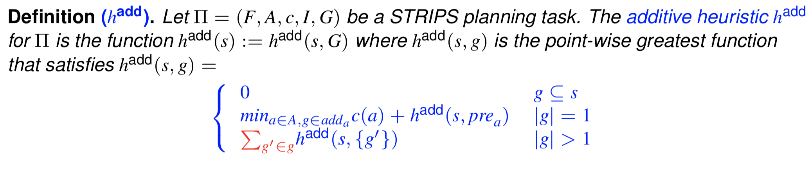
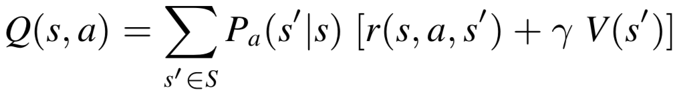
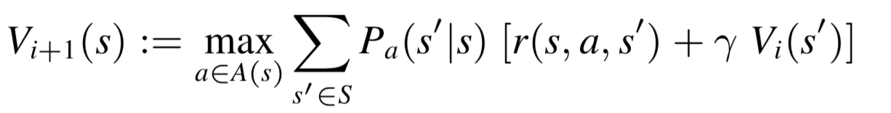
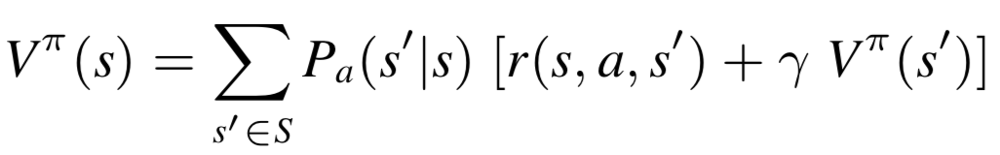
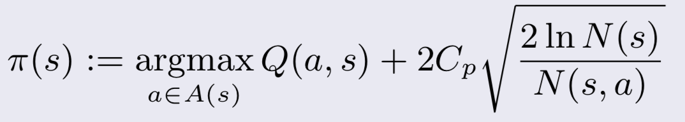

# 算法

| Short Name                        | Comment 1                                                    | Comment 2                                                    |
| --------------------------------- | ------------------------------------------------------------ | ------------------------------------------------------------ |
| STRIPTs                           |   |                                                              |
| BrFS(BFS)                         | Breadth-first-search                                         | - Completeness - Optimality(if costs are uniform)       |
| DFS                               | Deep-first-search                                            | - Not completeness - Not optimality                     |
| ID                                | Iterative Depening                                           | - Completeness - Optimality                             |
| GBFS                              | Greedy Best-First Search                                     |                                                              |
| BFWS                              | Best-First Width Search                                      |                                                              |
| $h^*$                             |                                                              | - Optimal one (theoretical)                                  |
| $h^+$                             |  | Safe, Admissible (drop deletion)                             |
| $h^{add}$                         |  | Safe, not admissible (based on $h^+$)                        |
| $h^{max}$                         |  | Safe, admissible (based on $h^+$)                            |
| $IW(k)$                           | - if  $novetly(s) > k$, then prune                           | - try to solve problem first in $IW(1)$, if not solved, then $IW(2)$, ... - **novetly:** smallest subset of atoms (which is first showing up) size of the new state  |
| MDP                               |  **Or**   | **fully** observable, **probabilistic** state models   - **value iteration:**(update value via last iteration value)   - **policy iteration:**(update policy via existing policy)  |
| MCTs                              |                                                              |                                                              |
| UCT                               |  |                                                              |
| Q-Learning                        |  off-policy optimistic unsafe or risky |                                                              |
| SARSA                             |  safe |                                                              |
| n-step SARSA                      |  |                                                              |
| Nash Equation                     |                                                              |                                                              |
| Mix strategies: Indifferency |  | - think of $A$ and $B$, the indifferency for $A$ is that the probability $X$ of selecting action $a$ that makes $B$ have the same reward. |

## Reinforcement Learning Cons

