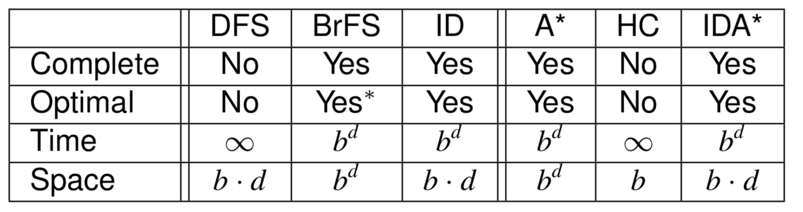
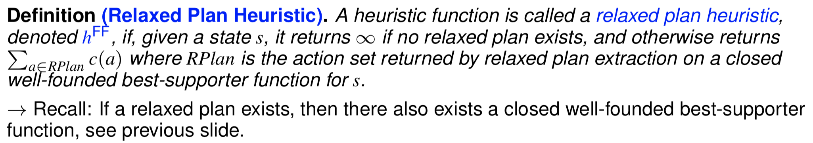

# AI


[TOC]


## Topics


- Search algorithms
- Planning models, languages, and computational approaches.
- Generating heuristics, delete relaxation
- Classical planning width
- MDPs and value/policy iteration
- Monte-carlo tree search
- Reinforcement learning: Q-learning, SARSA, n-step learning, reward shaping, function approximation
- Game theory: normal form games and extended form games


## 概念们

|                            |                                                              |                                                              |
| -------------------------- | ------------------------------------------------------------ | ------------------------------------------------------------ |
| Turing test                |                                                              |                                                              |
| Rationality and Omnisience | - An omniscient agent knows everything about the enviroment, and knows the actual effects of its actions.<br />- A rational agent just makes the best of what it has at its disposal, maximizing expected performance given its percepts and knowledge. |                                                              |
| STRIPS                     | (**St**anford **R**esearch **I**nstitute **P**roblem **S**olver) ,or a planning language to build planner, like PDDL |                                                              |
| Model                      | Principles/Description of a problem.                         |                                                              |
| Planner                    | a solver over a class of models; it takes a model description, and computes the corresponding controller |  |
| IPC                        | International Planning Competition                           |                                                              |

### Algorithm Names

[Algorithms](./Algorithms.md)

## Problems

- SAT
- CSP - Constraint Satisfaction Problems
- Classification
- Search


## Search Algorithms

### Search Algorithm Categories 

#### Blind Search and Heuristic Search 

##### Blind search

>  Only use the basic ingredients for general search algorithms. 
>
> - BFS
> - DFS
> - Uniform Cost

##### Heuristic Search

>  Additionally use heuristic functions which estimate the distance (or remaining cost) to the goal.
>
> - A*


#### Systematic search vs. local search

##### Systematic search

> Consider a large number of search nodes simultaneously. 

##### Local Search

> Work with one (or a few) candidate solutions (search nodes) at a time.


### Search Algorithms Evaluation

#### Completeness

Is the strategy guaranteed to find a solution when there is one?

#### Optimality 

Are the returned solutions guaranteed to be optimal?


#### 不同算法的特性



##### For Blind Search

|                            | Completeness ? | Optimality ?              | Time complexity                                              | Space Complexity        |
| -------------------------- | -------------- | ------------------------- | ------------------------------------------------------------ | ----------------------- |
| BFS                        | Yes            | Yes(if costs are uniform) | $O(b^d)$ or $O(b^{d+1})$<br />- $b$: max branching factors<br />- d: goal depth | same as time complexity |
| DFS                        | No(may loop)   | No(just select one)       | - worest: $O(b^m)$ <br />- best: $O(b*l)$                    | $O(b*m)$                |
| Iterative Deepening Search | Yes            | Yes                       | $O(b^d)$                                                     | $O(b*d)$                |

##### For Heuristic Search

|                          | Completeness ? | Optimality ? | Time complexity | Space Complexity |
| ------------------------ | -------------- | ------------ | --------------- | ---------------- |
| Greedy Best-First Search | Yes            | No really    |                 |                  |
| A*                       | Yes            | Yes          |                 |                  |
| Hill-Climbing            | No             | No           |                 |                  |
|                          |                |              |                 |                  |
|                          |                |              |                 |                  |


### Heuristic Function ($h\_value$)

Let $Π$ be a planning task with state space $ΘΠ$. A heuristic function, short heuristic, for $Π$ is a function $h: S 􏲏→ R^+_0 ∪ {∞}$. Its value h(s) for a state s is referred to as the state’s heuristic value, or h-value.


##### Remaining Cost($h^*$) ==> 理论最优解

Let $Π$ be a planning task with state space $ΘΠ$. For a state s ∈ S, the state’s remaining cost is the cost of an optimal plan for s, or ∞ if there exists no plan for s. The perfect heuristic for Π, written h∗, assigns every s ∈ S its remaining cost as the heuristic value.


#### Heuristic 特性

Let $Π$ be a planning task with state space $ΘΠ = (S, L, c, T, I, SG)$, and let $h$ be a heuristic for $Π$.

- **safe**: if $h∗(s) = ∞$ for all $s ∈ S$ with $h(s) = ∞$;
- **goal-aware**: if $h(s) = 0$ for all **goal states** $s ∈ SG$;
- **admissible**: if $h(s) ≤ h∗(s)$ for all $s ∈ s $;
- **consistent**: if $h(s) ≤ h(s ) + c(a) $for all transitions $s ^{(a)}→ s'$ .

##### 特性推理


#### Greedy Best-First Search

- Using priority queue
- 使用$h(state(\delta))$ 排序


#### A* Search

- $f\_value:= g(s) + h(s)$
- Generated nodes
- Expanded nodes
- Re-expanded nodes(re-opened nodes)


##### Implementation

- if $h$ is admissible and consistent, then A* never re-opens


#### Weighted A*

- with duplicate detection and re-opening
- **Weigth $W$  for $W*h(s)$ **
  - For $W=0$, weighted A* behaves like uniform-cost 
  - For $W=1$, weighted A* behaves like A*
  - For $W=\infin$, weighted A* behaves like greedy best-first search
- Adv:
  - if $h$ is **admissible**, then $W (W>1)$ makes the solutions $W$ times more costly than optimal ones.


#### Hill-Climbing 

- Only make sense when $h(s) >0 $
- Can easily get stuck in **local minima**
- Variations: different tie-breaking strategies, restarts...

#### Enforced Hill-Climbing

- undirected graph can be complete
- but not optimal

#### 

## Autonomous Approaches

### Comparison

|                   | Advantages                                                   | Disadvantages                                                |      |
| ----------------- | ------------------------------------------------------------ | ------------------------------------------------------------ | ---- |
| Programming Based | domain-knowledge easy to express                             | cannot deal with situations not anticipated by programmer    |      |
| Learning Based    | - Unsupervised or Supervised<br />- Evolutionary<br />- does not require much knowledge in principle | in practice, hard to know which features to learn, and is slow |      |
| Model Based       | - General Problem Solving(GPS)<br />- Powerful: Generality<br />- Quick: Rapid phototyping<br />- Flexible & Clear |                                                              |      |


### Programming based

Rule based


### Learning based

Train 


### Model based

#### 

|                                                      | State Model                                                  | Solution                                                     | Comment                                                      |
| ---------------------------------------------------- | ------------------------------------------------------------ | ------------------------------------------------------------ | ------------------------------------------------------------ |
| **Classical Planning**                               |  | a **sequence of applicable actions** that maps s0 into SG, and it is optimal if it minimizes sum of action costs (e.g., # of steps) |                                                              |
| **Conformant Planning(Uncertainty but No Feedback)** |  | an **action sequence** but must achieve the goal for **any** possible initial state and transition | - More complex(hard to verify one is conformant)             |
| **Markov Decision Processes (MDP)**                  | **fully** observable, **probabilistic** state models<br /> | **functions** (**policies**) mapping states into actions     | **Optimal** solutions **minimize** expected cost to goal     |
| Partially Observable MDPs (POMDPs)                   | **partially** observable, **probabilistic** state models<br /><br />**Belief states** are probability distributions over S | **policies** that map belief states into actions             | **Optimal** policies **minimize** expected cost to go from b0 to G |
|                                                      |                                                              |                                                              |                                                              |


### STRIPS: A planner language

|                                                              |                                                              |
| ------------------------------------------------------------ | ------------------------------------------------------------ |
|  |  |

#### From language to model

- PDDL 包括两部分: domain file和problem file
  - **problem file**: gives the objects, the initial state, and the goal state.
  - **domain file**: gives the predicates and the operators; each benchmark domain has one domain file.


#### How to solve STRIPS


#### Problems in Planning

##### Algorithmic Problems 

- Satisficing Planning
- Optimal Planning

Use "**(optimal)planners**" to solve these problems

##### Decision Problems

- **PlanEx(satisficing planning.)**: given a planning task P, whether or not there exists a plan for P.
- **PlanLen(optimal planning)**: given a planning task P and an integer B, whether or not there exists a plan for P of length at most B.
- **Both of them are PSPACE-complete**


##### NP, PSPACE, NPSPACE

- PSPACE: 可以被图灵机在多项式空间内解决, Polynomial SPACE
- NP: 算起来不一定快，但对于任何答案我们都可以快速的验证这个答案对不对


## Heuristic Functions

### Relax: 

**忽略某些factors, 使得问题可以近似到一个其他容易解决的问题**

简单来讲就是simplify problem

Definition:


### How to relax


##### Example:


#### Features of $r$ (transformation function)

- **native**: if $P′ ⊆P$ and$ h′^∗ =h^∗$
- **efficiently constructible**: $r$ function是一个多项式复杂度的算法- if there exists a polynomial-time algorithm that, given $Π ∈ P$, computes $r(Π)$ 
- **efficiently computable**: $h'^*$ function是一个多项式复杂的的算法 - if there exists a polynomial-time algorithm that, given $Π′ ∈ P′$, computes $h′^∗(Π′)$.


### Deletion Relaxation 

#### Dominance: 

| Definition                                                   | Proposition                                                  |
| ------------------------------------------------------------ | ------------------------------------------------------------ |
|  |  |
| 包含关系(子集)                                               | - 如果子集是goal,那么超集也是<br />- 如果一组actions组合可以在子集中用(valid), 那么也可以在超集中用(valid) |


|           |                                                              | Proposition                                                  |
| --------- | ------------------------------------------------------------ | ------------------------------------------------------------ |
| $h^{+}$   |  | deletion relaxation<br />(example: exists everywhere in truck demo) |
| $h^{add}$ |  | $h^{add}$ is Pessimistic<br />$h^{add}\ge h^*$<br /> (not addmissible, but always more informed than $h^{max} $) |
| $h^{max}$ |  | $h^{max}$ is Optimistic<br />$h^{max}\le h^*$<br />(addmissible, but far too optimistic, overfit) |
| $h^{FF}$  | <br /> |                                                              |


### Best-supporter function


### ILUYHOI:JHOIDFH(OU23019p817y9278t65r4^&*()P{LOKJHYt561783904rpoijhkbhvGUY*!&()PO"K:LMkknjhuifapodk[';f'])


## Width based planning

### Width-based search

##### Novelty function $w(s)$


#### Iterated Width (IW )

|  |
| ------------------------------------------------------------ |
|  |


#### Serialized Iterated Width (SIW)

- SIW uses IW for both decomposing a problemin to subproblems and for solving subproblems
- It’s a blind search procedure, no heuristic of any sort, IW does not even know next goal $G_i$ “to achieve”


### Balancing Explorer and Exploitation

##### Best-First Width Search (BFWS)


### Models and Simulators


#### Width-Based planning over Simulators Challenges:

- Non-linear dynamics 

- Perturbation in flight controls
- Partial observability
- Uncertainty about opponent strategy 


### Classical Planning With Simulators

- **Reinforcement Learning** and **Deep Learning** trained to learn a controller

- **Search algorithm** as a lookahead for action selection


## Markow Decision Processes (MDPs)

#### Definition


##### Policy: predefined plan for every state (how to select action for those states)


##### MDPS: Fully observable, probabilistic state models


|                             | MDPs                                | Classical     |
| --------------------------- | ----------------------------------- | ------------- |
| Transformation Function $r$ | no longer deterministic             | deterministic |
| Goals                       | No (but rewards)                    | Yes           |
| Action cost                 | No (but negative rewards)           | Yes           |
| Discount Factor ($\gamma$)  | Yes (for future, uncertain rewards) | No            |


#### Formulas

|                                               |                                                              |                     |
| --------------------------------------------- | ------------------------------------------------------------ | ------------------- |
| **expected discounted reward from state $s$** |  | - $\pi$: the policy |
| **Compute MDPs (Bellman equations)**          | <br />Or<br /><br /> | recursively         |


### Value iteration

#### Value Iteration: finds the optimal value function V∗ solving the Bellman equations iteratively, using the following algorithm:

- Set $V_0$ to arbitrary value function; e.g., V0(s) = 0 for all s.

- Set $V_{i+1}$ to result of Bellman’s right hand side using $V_i$ in place of $V$

  > 


- Stop when $R = max_s |V_{i+1}(s) − V_i(s)| <= \epsilon$, where $\epsilon$  is a predefined threhold
- Example (**Assuming no action costs and γ = 0.9**) :

> 1. initial all $V_0 = 0$
> 2. calculate $V_1$, by select $max$ reward of next state $s'$, eg, the one on the left of  `+1`, $max_reward = \gamma * p(right) * 1 = 0.9 * 0.8 * 1 = 0.72$
> 3. loop until $max_s |V_{i+1}(s) − V_i(s)| <= \epsilon$
>
> 


#### How to select policy from value iteration (policy extraction)

simpley select : $$action = argmax_{a\in A(s) }Q(s,a)$$


### Policy Iteration

Create a improved policy in each iteration.


#### Policy evaluation

Formula: 

|      |                                                              |                                                              |
| ---- | ------------------------------------------------------------ | ------------------------------------------------------------ |
|      |  | - $V^\pi(s)$: The expected cost of policy $\pi$ from state $s$ to $goal$<br />-  $s'$: Next state generate by action $a$ |
|      |  |                                                              |


#### Policy iteration steps

- Starting with arbitrary policy $\pi$
- Compute $V^π(s)$ for all $s$ (`policy evaluation`) 
- Improve $\pi$ by setting $π(s) := argmax_{a∈A(s)} Q^π (a, s)$ (improvement) 
-   If $π$ changed in 3, go back to 2, else finish 


### Partially Observable MDPs

relax the assumption of full-observability. A POMDP is defined as:


#### Solve MDPs

- each state is a probability distribution over the set $S$
- each state of the POMDP is a ***belief*** state, which defined the probability of being in each state $S$.
- solutions are policies that **map belief states into actions**
- Optimal policies **minimise** the expected cost


## Monte Carlo Tree Search

- offline planning method: make decision at runtime, need calculation for every single step


### Steps:

| #    | Step          | Description                                                  |
| ---- | ------------- | ------------------------------------------------------------ |
| 1    | Select        | Given a tree policy, select a single node in the tree to assess. |
| 2    | Expand        | Expand this node by applying one available action from the node. |
| 3    | Simulation    | From the expanded node, perform a complete random simulation to a leaf node. This therefore assumes that the search tree is finite (but version for
infinitely large trees exist). |
| 4    | Backpropagate | the value of the node is backpropagated to the root node, updating the value of each ancestor node on the way. |


### pseudo  code


|                       |                                                              |                                                              |
| --------------------- | ------------------------------------------------------------ | ------------------------------------------------------------ |
| Nodes                 | store pair s, a, pointer to parent and Q(a, s)               |                                                              |
| Node Expansion        | Apply action $a$ to state $s$ to get $s'$, with probability $Pa(s,s′)$ |                                                              |
| $TreePolicy(root)$    |  | $Pa(s,s′)$ is stochastic, so several visits (in theory an infinite number) may be necessary to generate all successors. |
| $DefaultPolicy(best)$ |  |                                                              |
| $Backup(best,\Delta)$ |  |                                                              |


### Multi-arm bandit - 如何选择expand node - exploration  and exploitation

#### Definition

An N-armed bandit is defined by a set of random variables $X_{i,k}$ where $1 ≤ i ≤ N$, such that $i$ is the arm of the bandit; and $k$ the index of the play of arm $i$. (we **do not know** the probability distributions of the random variables.)


**In this definition, we can transform it to a MCTs problem:**

- actions $a$ applicable on s are the “arms of the bandit“
- $Q(a, s)$ corresponds to the random variables $X_{i,n}$


### Flat Monte Carlo (FMC)

- select each arm with the same probability
- $Q\_value$ for an action $a$ in a given state $s c$an be approximated:

> 
>
> - N(s,a) is the number of times a executed in $s$.
> - $N(s)$ is the number of times $s$ is visited.
> - $r_t$ is the reward of $t^{th}$ simulation from $s$
> - $I_t(s,a)$ is 1 if a was selected on the $t^{th}$ simulation from $s$, and is 0 otherwise


#### Issue of FMC

- 所有action都有相同概率被选中, 浪费时间, 效率低
- 更好的做法是focus on **the most promising parts** of the tree given the rewards we have received so far.

### Exploration vs. Exploitation

#### The Fear of Missing Out (FOMO)

##### regret

If I play arm b, my regret is the best possible expected reward minus the expected reward of playing b. If I play arm a (the best arm), my regret is 0. Regret is thus the expected loss due to not doing the best action

> 当选择的不是最优的选项时, 所丢失的分数


##### Minimum regret

|                     |                                                              |                                                              |
| ------------------- | ------------------------------------------------------------ | ------------------------------------------------------------ |
| ***ε*-greedy **     | 随即一个[0,1]的数$r$, 如果$r<\epsilon$, 那么随机选择arm; 否则选择目前已知最好的 | Typically, values of $ε$ around `0.05-0.1` work well.        |
| ***ε*-decreasing ** | same as $ε$-greedy, 但是 $\epsilon$ 每次都会减小(更偏向于使用已有知识); A parameter $\alpha$ between [0,1] specifies the decay, $\epsilon := \epsilon * \alpha$ |                                                              |
| **Softmax**         |  | ***τ*** is the temperature, a positive number that dictates how much of an influence the past data has on the decision. |
| **UCB1**            | refer to below for details                                   |                                                              |
|                     |                                                              |                                                              |


####  Upper Confidence Bounds (UCB1)

how to select policy accoding to current state $s$ and prelearned knowledge ($Q_{value}$ and play count) :

|                                                              | exploitation                                                 |       | exploration                                                  |
| ------------------------------------------------------------ | ------------------------------------------------------------ | ----- | ------------------------------------------------------------ |
|  |  | **+** |  |
|                                                              | weight from learned knwoledge                                |       | weigth from select count (the less the big)                  |

- $Q(a, s)$ is the estimated *Q*-value.
- $N(s)$ is the number of times *s* has been visited.
- $N(s,a)$ is the number of times *a* has been executed in *s*.


### Upper Confidence Tree (UCT)  ===> $UCT = MCTS + UCB1$


- $C_p > 0$: exploration constant **(bigger $C_P$  encourages more exploration)**


### Value/Policy interation VS. MCTs

|          | Value/Policy iteration                  | MCTS                                                         |
| -------- | --------------------------------------- | ------------------------------------------------------------ |
| Cost     | High                                    | Low                                                          |
| Converge | Higher(works from any Robustness state) | Low (works only from initial state or state reachable from initial state) |
|          | 一次计算,终身受用 (offline)             | 每步(之前没碰到过的)都需要重新计算(online)                   |


## Reinforcement Learning


### Learnning

- Maintain a Q-function that records Q(s, a) for every state-action pair.
- Repeat for each step until *converge/timeup/good engouth:*
  - choose an action using a multi-armed bandit algorithm
  - apply that action and receive the reward
  - update Q(s, a) based on that reward


#### Q-Function

Used to update ***Q_value***


#### Q-Table

Used to maintain Q-Values from Q-Function

> 


#### How to use Q-Table/Q-Function

**Policy Extractation**: (same as the one we used in *value iteration*)


### Q-Learning and SARSA

| Q-Learning                                                   | SARSA                                                        |
| ------------------------------------------------------------ | ------------------------------------------------------------ |
|  |  |
| Off policy (ignore the action selected by policy)            | On policy (learn action values from policy)                  |
|  |  |
| (1) selects an action $a$; <br />(2) takes that actions and observes the reward & next state $s′$;<br />(3) updates optimistically by assuming the future reward is
$max_{a′} Q(s′,a′)$ – that is, it **assumes** that **future behaviour will be optimal** according to its policy. | (1) selects action $a′$ for the **next loop iteration**;<br /> (2) in the next iteration, takes that action and observes the reward & next state $s′$; <br />(3) only then chooses $a′$ for the next iteration; <br />(4) updates using the estimate for the actual next action chosen – which may not be the best one (e.g. it could be selected so that it can explore). |
| converge to the optimal policy irrelevant of the policy followed (unsafe, risky, 风险与机遇并存, 最优同时意味着里危险最近, 例如Q-learning会选择悬崖边这条Optimal路) | converge to the optimal policy that according to the original policy(选择相对Optimal的路, 可能会**牺牲**一些分数来保证**不会触发最坏的情况**) |
| better when 有充足时间来进行训练 (better for offline learning) | better when learns while operating in its environment(应用在真实环境学习的情况, better for online learning) |


### SARSA 

**On-Policy**: Instead of estimating Q(s′,a′) for the best estimated future state during update, on-policy uses the actual next action to update


### Q-Learning & SARSA  (TD methods) Weaknesses

- take long time to propagate (pass known knowledge to eary states)
- Q-Table is too big sometimes ($|A| * |S|$)
- Hard to converge
- Rewards can be spare, which means that a better state cannot be sensed in a short time.


#### Improvement methods:

- **n-Step temporal difference learning**: look nsteps ahead for the reward before updating the reward
- **approximate methods**: using approximate method to eliminate the need for large Q-table, and also allow providing reasonable estimates of $Q(s,a)$ even if $(s,a)$ never been applied before
- **Reward shaping and value-Function initialisation**: MOdify/augment our reward function to make the better states to be sensed easier.


## n-Step learning: TD ($\lambda$)

- $\lambda$: the number of steps that we want to look ahead
  - $T(0)$ -> standard reinforcement learning
  - $T(1)$ -> looks one step ahead 
  - $T(2)$ -> looks 2 steps ahead 

- Back propagation for $n$ steps 


### Approximate Reinforcement Learning

- used to reduce the ***large state space*** problem, by 

```
1. only consider most improtant features (or a linear combination of features)
2. using the features selected from step 1 in Q-function
3. using value from step 2 to update Q-table (instead of Q-function with state)
```


### Q-value for approximation

| Definition                                                   | Example                                                      |
| ------------------------------------------------------------ | ------------------------------------------------------------ |
|  |  |


#### Q-function Update (update *weight* instead of actions)

- For Q-learning

> 

- For SARSA

> 


#### Q-value propagation

once we get a reward, we get a matrix of ***W***, so that we can use this for all states


#### Approximation with Neural Networks


### Shaping reward

- used for spare rewards by applying domain knowledge (point out what a good state looks like)

> 


#### Potential-based reward shaping


## Game Theory

### normal form game (a game in strategic form)

non-zero-sum game

**dominant strategy: 总是对自己最好的choice (for all actions the other one may choose)**


#### Nash Equilibrium


#### Mixed Strategies

##### Indifferency:

$E(p_i, s) = E(p_i, s')$


#### Extended form games

Information of a state cannot be fully seen/sensed by players

- do research before choosing (so that there we do choose based on knowledge from research, like buy things based whether a product is good)


