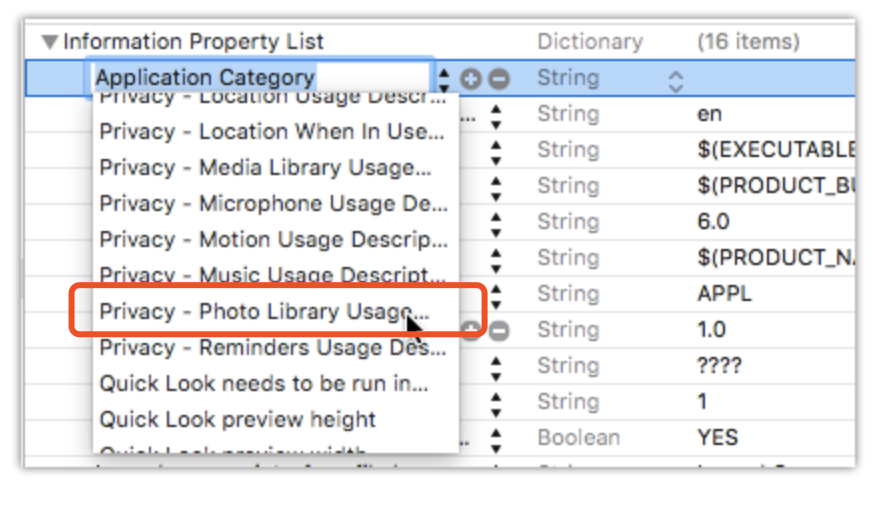

# How to use camera or photo library of iOS

### 0. Set privacy 

1. open `Info.plist`  and add new rules (photo library as an example)

   ```
   Privacy - Photo Library Usage Description
   Privacy - Photo Library Additions Usage Description
   ```




2. 


### 1. extension class with UIImagePickerControllerDelegate

```swift
extension MyClass: UIImagePickerControllerDelegate{
     func imagePickerControllerDidCancel(_ picker: UIImagePickerController) {
         // 
    }
    
    private func imagePickerController(_ picker: UIImagePickerController, didFinishPickingMediaWithInfo info: [String : Any]) {
        var newImage: UIImage
        
        if let possibleImage = info["UIImagePickerControllerEditedImage"] as? UIImage {
            newImage = possibleImage
        } else if let possibleImage = info["UIImagePickerControllerOriginalImage"] as? UIImage {
            newImage = possibleImage
        } else {
            return
        }
        
        // do something interesting here!
        print(newImage.size)
        
        dismiss(animated: true)
    }
}
```

### 2. provide below functions for selecting photo or use camera


```swift
func camera()
    {
        if UIImagePickerController.isSourceTypeAvailable(.camera){
            let myPickerController = UIImagePickerController()
            myPickerController.delegate = self;
            myPickerController.sourceType = .camera
            currentVC.present(myPickerController, animated: true, completion: nil)
        }
        
    }
```


```swift
func photoLibrary()
    {
        
        if UIImagePickerController.isSourceTypeAvailable(.photoLibrary){
            let myPickerController = UIImagePickerController()
            myPickerController.delegate = self;
            myPickerController.sourceType = .photoLibrary
            currentVC.present(myPickerController, animated: true, completion: nil)
        }
    }
```

## A function to show options to user

```swift
func showActionSheet() {
        let currentVC = vc
        let actionSheet = UIAlertController(title: nil, message: nil, preferredStyle: .actionSheet)
        
        actionSheet.addAction(UIAlertAction(title: "Camera", style: .default, handler: { (alert:UIAlertAction!) -> Void in
            self.camera()
        }))
        
        actionSheet.addAction(UIAlertAction(title: "Gallery", style: .default, handler: { (alert:UIAlertAction!) -> Void in
            self.photoLibrary()
        }))
        
        actionSheet.addAction(UIAlertAction(title: "Cancel", style: .cancel, handler: nil))
        
        self.present(actionSheet, animated: true, completion: nil)
    }
```

