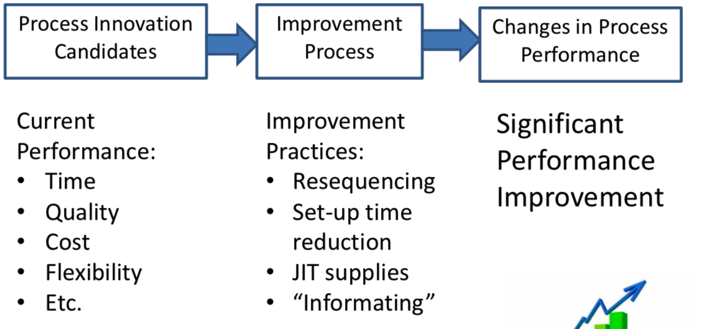
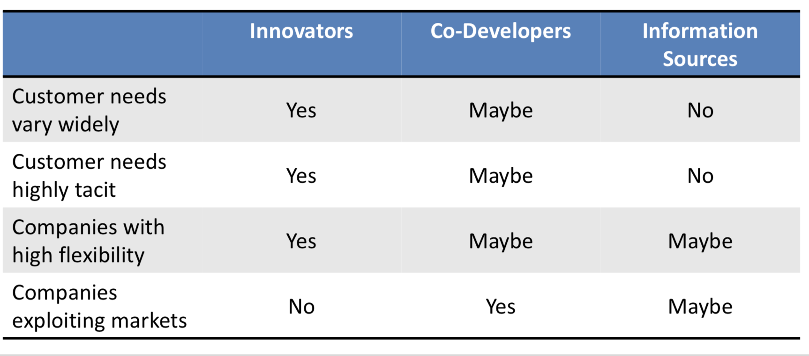
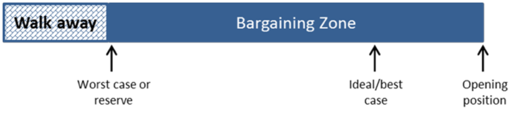

# Innovation

[TOC]

## Introduction

### Requirements:

- Creativity
- Observation
- Analysis
- Guessing

### Innovatoin Cycle

### Analysis before innovation

#### is there a **market** for it ?

- is it **real**?
- what is the **target segment**?
- can the proposed product do a better job of meething the **customer's needs**?
- does the customer **want** it?
- **can** the customer buy it?

#### dose it actually work?

- clear concept?
- can we build it?
- will it satisfy the market?

 ### Difference between adaptors and innovators

| Facet       | Adaptors                                                     | Innovators                                                   |
| ----------- | ------------------------------------------------------------ | ------------------------------------------------------------ |
| Originality | Think of **a few** solutions, most of which **can** be implemented | Propose **many** solutions, most of which are **impractical** |
| Efficiency  | step by step to a defined goal                               | avoid attention to detail                                    |
| Governance  | restrict their behavior to what is socially acceptable       | ignore rules or invent own rules as they go                  |

### Why innovation is important

- for profile
- date?

### Digital Innovation 

#### Valuable Novelty

#### Types of innovations(Digital)

| Type                | Desc                                                         | Focus on                                                     | eg                                                           |
| ------------------- | ------------------------------------------------------------ | ------------------------------------------------------------ | ------------------------------------------------------------ |
| Process innovation  | New way of doing things embodied or enabled by IT.           | Typically focus on technology adopters                       | new process for parking management via IT                    |
| Product innovation  | New products or services that emboied in or enabled by It    | Typically focus on technology producers                      | Platforms (like AWS?), consumer products and **enhanced services(like online shoping?) |
| Business innovation | New business models about how an organisation creates. delivers and captures value (embodied in or enabled by IT) | Typically focus on technology producers - **often accompanied by product innovation** | Uber                                                         |

#### How to innovate with IT

##### Mindful: attending to an innovation with reasoning grounded in an organisation’s own facts (to solve an existing problem or provide an improved solution)

##### Mindless: being content with “everyone is doing it” as a rationale for adoption, and accepting innovations promoted by consultants and by CEOs who encounter fashionable ideas

## Diffusion Theory

| Diffusion Theory                            | Figure                                                       |
| ------------------------------------------- | ------------------------------------------------------------ |
| Rogers                                      |  |
| Technology Lifecycle Model                  |  |
| Technology adoption times have decreased... |  |
| S-Curves stacked up                         |  |
| Gartner’s Hype Cycle                        |  |
| The Chasm in the Diffusion Model:           | over 90% of innovations fail  80% start-ups DEAD in 5 years |

#### Other influences on diffusion

- the **more people involved** in the decision, the **slower the diffusion** 
- Communication channels 
- Social system 
- Promotional activities by change agents 

#### Icremental Versus Disruptive Innovation

- technological progress outstripped the ability of customers
- that is, 新的技术产品所提供的功能 >> 用户所需要的功能

## Process Innovation

- business process:
  - structured
  - measured
  - set of activities
  - for producing a specific output (for a particular customer or market)
  - a strong emphasis on how work is done within an organization (in contrast to products)
- process:
  - a specific **ordering** of work activities
  - needs time and space
  - with a beginning and end
  - clearly defined inputs and outputs

#### Process comes first, then we got product innovation

> 

#### Steps of process innovation

##### Origanisational

##### re-engineering (drop all existing process and redo all of them ! )

- must be a missionary, motivator and  leg breaker
- re-engineering eliminates(reduce) **work**, not jobs or people
- Disadvantages:
  - many radical designs **could not be afforded**
  - build IT process took a long time, leading to loss of momentum
  - although aimed at process (not organisational transformation), it was often advertised as "transformative" (也就是可能导致组织结构的变化?)

###### alternative to re-engineering - business simplification

> 

## Product (and service) Innovation

### How to do product innovation

- R & D

> 

- Design thinking

### Design thinking

- human centred, creative problem seeking & solving framework that draws on the skills and mindsets of a designer

| Action                              | Figure                                                       |
| ----------------------------------- | ------------------------------------------------------------ |
| integrates                          |  |
| Different Thinking                  |  |
| Feels like                          |  |
| Intuition Ard VS. Analytics Science |  |
| Think more than users themselves    |  |
| Process                             | - Empathize (listening requirements) - Define (ideas that based on users' needs) - Ideate (brainstorm many solutions) - Prototype (build prototype to show your solution) - Test (test prototype with users and get feedbacks) |

### Serivce Innovation

#### 4 strategies (or flavours) of "smart services":

- **embedded innovator**: 在现有设备/环境上, 增加innovation (但是add connectivity通常会cost a lot)
- **?? solutionist**: a product is dominant way to business opportunity, but scope of high-value activities associated with the product is broader
- **Aggregator**: Integrating many devices or technologies (instead of only one)

- **Synergist**: 为connected的devices,创造有价值的数据(eg, sensors?)

#### 3 main approaches to service innovation:

- Technologist(or assimilation)
  - **??** User (or adopt) technology to deliver services (eg, ISP, 3G/4G, only deliver mobile internet services. don't manufacture any technologies)
- Service-oriented or differentiation
  - focus on actual services (instead of products or process), eg, consulting services
- Integrative or synthezing approach
  - Use **both** manufactured goods and services

## Innovation start-ups vs mature companies

|                     | Chaos        | Uncertainty                                                  | Business Model                  | Verify                   | Action                                                       | Comments                              |
| ------------------- | ------------ | ------------------------------------------------------------ | ------------------------------- | ------------------------ | ------------------------------------------------------------ | ------------------------------------- |
| In Start-ups        | Chaos        | Very high levels of uncertainty  (Forecasts are useless as are business plans) | Business models unknown         | Lots of customer testing | Pivoting                                                     | not small versions of large companies |
| In mature companies | Less chaotic | more certainty                                               | well known and more predictable | Principal/Agency problem | three key items: 1. operationally efficient and low-cost producer 2. innovate and differentiate your products  3. need scale |                                       |

## Open vs Closed innovation

|         | Traditional(Closed) Innovation                               | Open Innovation                                              |
| ------- | ------------------------------------------------------------ | ------------------------------------------------------------ |
| Comment | target on its own markets (ignore projects that provide no help to the company itself) | try every thing and try to find new market.(some unuseful projects may go out to other companies and eventually meet a win-win, more corporation, more sharing and win-win) |
| Figure  |  |  |
| Thought | - samrt people in company - do valuable R&D all **by itself** - who gets 1st innovation wins the market - create best ideas **by itself** - control own IPs - **own** all results from contract research | - smart people inside and outside of company and corporate  - relay on both external and internal R&D - build better business model matters (more than get to market first) - use both internal and external ideas - license in and license out - **partner** with university |

## Business Model Innovation

### What is business model

A business model describes the rationalise of **how** an organisation **creates, delivers and captures economic value.**

### What is business model innovation

**A new way of doing business.**

### When a new business model is needed:

- There is an opportunity to: 
  - get large potential customers
  - 有(突破性的)新技术
- There is a need to :
  - Defend against new, low-end competition 
  - Respond to a shifting basis of competition 

### Examples

| Case                  |                                                              |      |
| --------------------- | ------------------------------------------------------------ | ---- |
| Xerox                 | Lease their equipments instead of selling them               |      |
| Dolby Noise Reduction | Licencing Strategy                                           |      |
| Software-as-a-service | - freemium model (charge for additional features, instead of the product itself) - subscribe |      |
|                       |                                                              |      |
|                       |                                                              |      |

### Business model canvas

| Fields                 | Desc                                                         | Example                                                      |
| ---------------------- | ------------------------------------------------------------ | ------------------------------------------------------------ |
| Key Activities         | most important activities                                    | An example for Bic, the pen manufacturer, would be creating an efficient supply chain to drive down costs. |
| Key Resources          |                                                              | These resources could be human, financial, physical and intellectual. |
| Key Partners           | - optimize operations  - reduce risks                   |                                                              |
| Value Propositions     | collection of **products** and **services** a business offers to meet the needs of its customers | The value propositions may be:   - Quantitative – **price and efficiency**  - Qualitative – **overall customer experience and outcome** |
| Customer Segments      | identify which customers it tries to serve                   | **group** customers by their different needs and attributes  |
| Channels               | how to **deliver(contact)** its value proposition to its targeted customers | - physical deliver CDs - streaming videos - online platform - etc. |
| Customer Relationships | identify the type of relationship they want to create with their customer | - Personal Assistance - Self Service - Automated Services - etc. |
| Cost Structure         | describes the most important monetary consequences           |                                                              |
| Revenue Streams        | The way a company makes income from each customer segment    | - Asset Sale - Usage fee - Subscription Fees - Lending/Leasing/Renting - Licensing - Advertising |

## Customer Development Process

### Steps

> 

- Iteration
  - Customer Discovery
    - test a number of hypothesis
    - Hypothesis --> facts 
    - Stop when we’ve found something that could work 
  - Customer Validation
    - Look for scalable & repeatable business model 
    - If none found, pivot back to the start 
- Execution
  - Customer Creation
    - build features & functionality 
    - Prepare for scaling 
  - Company Building
    - Scale-up and grow 
    - Building a company is much more(**harder**?) than building technology 

### Minimum Viable Product (MVP)

- create a prototype, model or basic product/service
- don’t spend too much time or money

### Customer-led innovation (one form of open innovation)

#### Factors that make innovation success

- Increased mobility of skilled workforce 
- Growth in VC
- New products/services are introduced much faster
- large companies move slowly

#### Information from Customers

information includes **Customer needs, Company capabilities**.

- new prodcut **ideas**
- **inputs** on product features and design 
- Product **testing** 
- Product **support** 
- Identify risks:
  - Increased complexity 
  - Decreased control 

#### How to listen to customers

Who will hand that information

### Lead-user innovation (one form of open innovation)

- Different to consumer-led innovation 
- Early/key users, early adaptors

## Lean Start-up

### Steps

### Start-ups missions:

- Find a **repeatable**, **scalable** business model 

- Build **great products** that customers actually want to buy 

- **Get, keep and grow** customers 

- **Make money** directly or indirectly from these customers 

- **determine market size**

  > 1. Industry size - how many people need this
  > 2. How many companies currently do the same thing as your company and get a reasonalbe market share %.
  > 3. What is the current cost of your potential users in such problem
  > 4. How much money your solution can save if user use your products
  > 5. Evaluate the revenue of your company.

### Comparasion with traditional way

|                   | Traditional                                                  | Lean Start-up                                                |
| ----------------- | ------------------------------------------------------------ | ------------------------------------------------------------ |
| Development Model | Waterfall –  Requirements   –  Design   –  Implementation   –  Verification   –  Maintenance | –  Data   –  Feedback   –  Insights   –  Extremely rapid deployment   –  Just-in-time architecture and infrastructure |
| Start-up Model    | –  Raise money   –  Develop product   –  Test product   –  Launch product   –  Hope for the best | Customer Development - Hypotheses - Experiments - Insights - Incremental, quck, minimum features - Customer and revenue validation |

### [+++] Pivots

Adjust the development strategy of the company or adjust (or even redesign) the products, based on the feedback from marked, and then running company with the improved/adjusted strategy/products.

### IP (intelligence Property)

the creation, ownership and control of original ideas as well as the representation of those ideas.

​														- Whitman and Mattord, 2014)

#### Includes:

- Knowledge (individual and organisational)
- Creative works 
- Designs
- Processes
- etc.

#### How to protect

|          | Formal                                                       | Informal                                                     |
| -------- | ------------------------------------------------------------ | ------------------------------------------------------------ |
| How      | - patents (no copy at all)  - trademarks (easy and cost effective)  - copyright (easiest, just add ©)  - design registrations (a little more involved) | - design complexity - trade secrets(may protected by laws)    - lead-time advantage |
| Downside | - some require lots of time and money - patents disclose your IP from world (别人想enhance或者周边你的产品都不行) |                                                              |
| Eg       | Biotechnology industry (很多要有专利保护)                    | - the secret formula’s held by Coca Cola and KFC for their ‘secret recipes’ |

### How to choose protection method

### Lean Start-up tools

#### LOFA (Leap of faith assumptions)

- set of hypothesis

- Do not survey/interview people

- Test with MVP, model or prototype

- Illulate/State assumptions – be very precise and clear 

- Focus on actions that are in the present and have a high impact 

  > 

### The Lean Canvas

Start with problem

> - Metrics (**AARRR**):
>   - Acquisition 
>   - Activation 
>   - Retention 
>   - Referral
>   - Revenue 
>
>  

### Cost of sales

- extremely important 
- a key factor to decide whether a product/service is profitable
- include:
  - all costs about selling and distributing
  - marketing
- not include:
  - R&D,productdevelopment,etc 
  - General overhead/administration expenses

  - Otherbusinessexpenses(telco,rent,power,etc) 

#### CAC (customer acquisition costs, 获取用户的成本)

### Strategies for start-ups

#### What is strategy

- to determine what to do 
- Operational Effectiveness(OE) is NOT strategy 

#### What is OE (operational effectiveness)

OE is important, but it needs to occur **in parallel to strategy** not in place of strategy. 

- Be flexible to respond rapidly to competitive and market changes 
- Benchmark continuously to achieve best practice 
- Outsource aggressively to gain efficiencies 
- Nurture a few core competencies in race to stay ahead of rivals 

#### Strategy planning tools

|                                  |                                                              |      |
| -------------------------------- | ------------------------------------------------------------ | ---- |
| Five-forces model (Porter, 1979) |  |      |
| SWOT                             |  |      |
| Ansoff’smatrix                   |  |      |
| PESTEL                           |  |      |

## Negotiations

### Interpersonal skills

- help you build rapport quickly
  - first three minutes 
  - essential in conflict management and negotiations

> ##### Improve your interpersonal skills
>
> - Make **eye contact** and **smile**. 
> - Be aware of your **body language** 
> - Remember names 
> - Be a good **listener** – encourage people to talk about themselves 
> - Find something you **have in common** 
> - Give **honest** and **sincere** appreciation 
> - **Make people feel important** and do so **sincerely** 
> - Don’t criticize, condemn or complain 
> - **Admit** when you are **wrong** 
> - Speak from the heart – share your passions 
> - Respect other’s opinions – never say ‘you are wrong’ 
> - Be sympathetic with other person’s ideas or desires

#### Communication skills

##### Listen first

- people typically want to be understood first
- 5 levels of listening
  - ignoring (not listening)
  - pretending (not listening)
  - selective (not listening)
  - attentive - passive
  - Empathic - listen for meaning (with eyes, ears, brain)

### Negotiation skills

#### Tasks:

- Planning
- Creating value (to the other side) and claim value(from the other side)
- Establishing bargaining zones

> 

##### Bargaining Zone

|                          |                                                              |
| ------------------------ | ------------------------------------------------------------ |
| Positive bargaining zone |  |
| No bargaining zone       |  |

#### Stages

- Prepare 

- Discuss (Everything is negotiable) 
- Propose (If ... then ...) 
- Bargain (Never give unless you also get) 

## Everyone needs help

### Incubators

- Co-working spaces for start-ups with great potential
- offer
  - Space
  - desks 
  - technology
  - support services (admin, mentors, coaches, etc.)

### Entrepreneurial Theory

| Name                     | Key idea                                                     | Explain                                                      |
| ------------------------ | ------------------------------------------------------------ | ------------------------------------------------------------ |
| Neoclassical equilibrium | information and knowledge is evenly and equally dispersed in markets | - no one has full knowledge or information of the market place |
| Austrian economists      | Information & knowledge is not equally known by everyone     | - need prior knowledge in a relevant industry or technology  - important knowledge and ckground allows successful innovations |
| Opportunity Recognition  |                                                              | - identify opportunity by exploiting - idea of innovation comes from recognising new technology |
| Psychology               |                                                              |                                                              |

### Team building

#### How to build a high performance team

| Stage               | Action                                                       | Skills needed                                                |
| ------------------- | ------------------------------------------------------------ | ------------------------------------------------------------ |
| Specify             | identity what kind of employee you really need               | - in-depth knowledge of every role                           |
| Recruit             | search and hire                                              | - interpersonal skill - interviewing skill - assessment  - cirtical analysis |
| Integrate           | Induction & on-boarding                                      |                                                              |
| Maximise(encourage) | Ensure new staff are productive and performing to the best of their abilities |                                                              |
| Review              | Provide all employees with feedback on their performance     |                                                              |

### (inspirational)Leadership

#### Effects: improve individual and organisation performance

- confidence in teams 
- motivates people
- build trusts 

#### Emotional Intelligence

- conflict management 
- developing other people’s skills & capabilities 
- motivating and influencing people
- inspiring people 

### Venture Capital (VC)

#### Advantages

- money
- Coaching and mentoring 
- Industry contacts and networks 
- Expertise in scaling and expanding overseas 
- Other corporate services (finance, legal, IPO’s, etc.) 

> 

#### Disadvantages

- Existing shareholders get diluted
- Lose control of your business by:
  - VC appoints directors
  - Directing executive management hires 

#### Corporate Structures

> sole trader,partnership,private,public,trusts (many types), etc

- **??Private Company**: PtyLtd - proprietary limited company,limited liability (limited by shares)
- **??Publically Listed Company**: Ltd – publically listed company, limited liability (limited by shares)

##### ??VCLP: Venture Capital Limited Partnership

- VCLP has a general partner who manages the fund and limited partners who invest money 
- Limited partners have limited liability and not involved in day-to-day management 

#### Board of Directors (董事会?)

#### Finance

- P&L 
- BalanceSheet
- Cash Flow Statement 

#### Admin, Legal & Compliance

- Company constitution 
- Shareholder’s agreement 
- Partnership agreement  
- Employment contracts 
- Business registration
- Payroll Tax  
- Annual returns  - ATO
- Other returns - BAS ()
- Audits

### How to value startups

- Multiple of their earnings or revenue
- Market Capitalisation

> A VC invests 10 million for 50% of a start-ups shares, the start-up would be valued at 20 million 

- Growth valuations, example – customer life time value (CLTV) 

> in relation to cost of customer acquisition, can measure how long it takes to recoup investment required to earn a new customer 

> 

