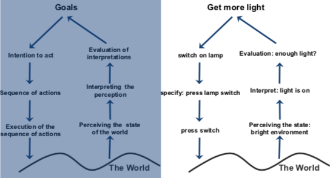
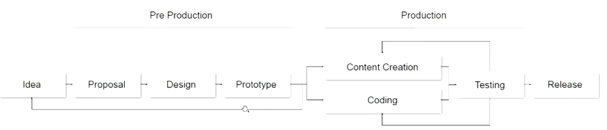
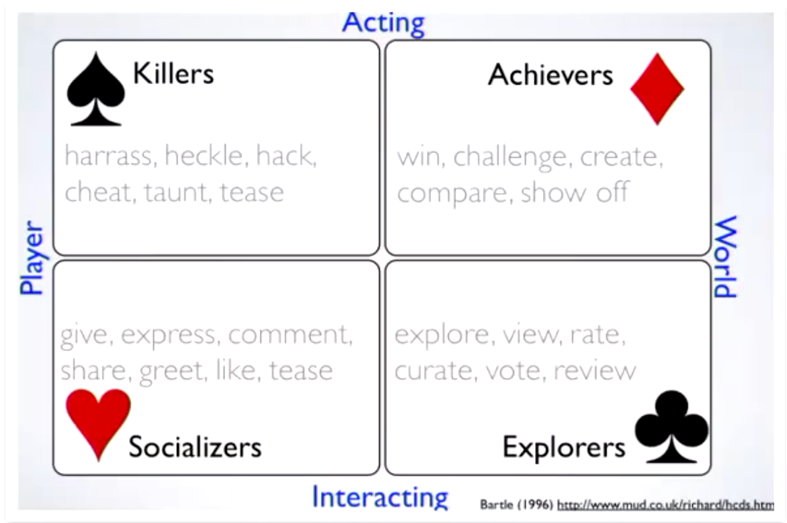
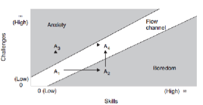
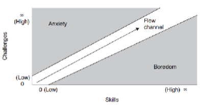
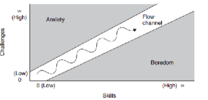
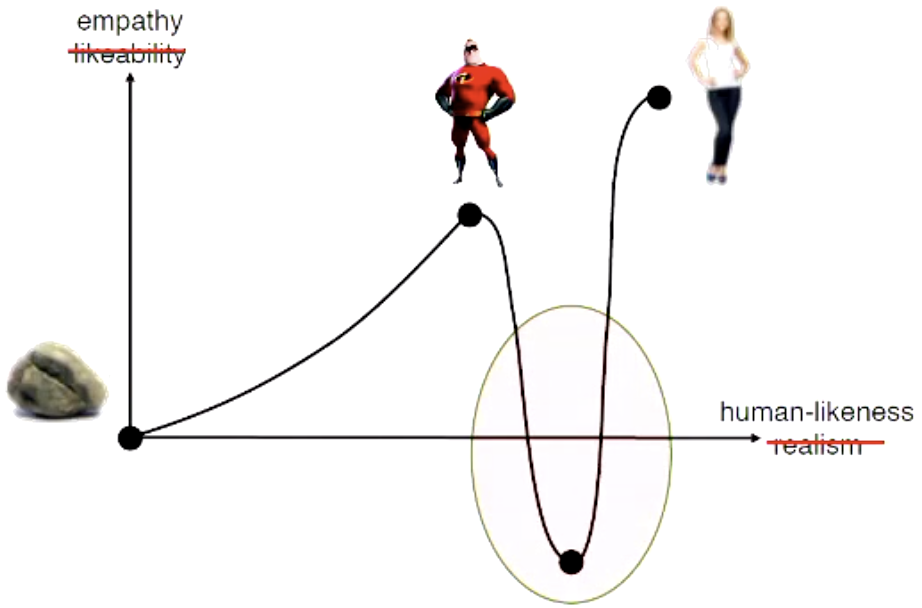
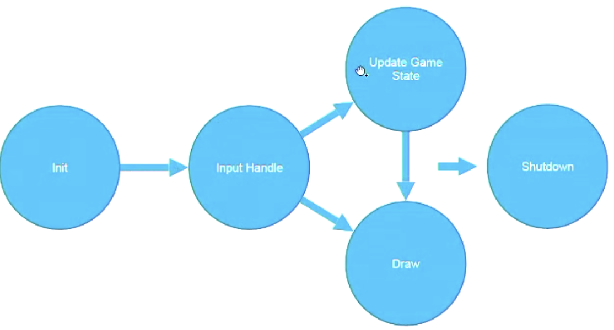
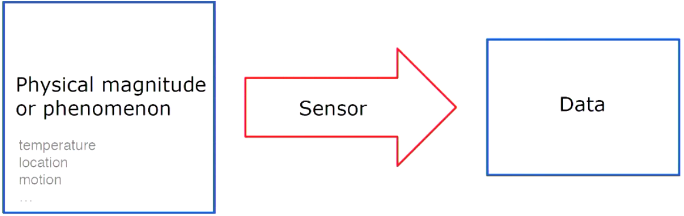
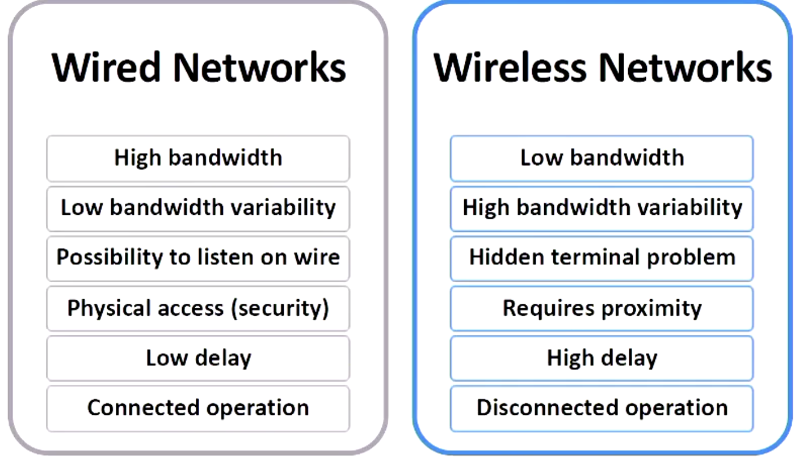

#  Mobile

[TOC]

- Mobile User Interfaces
- Mobile Games
- Sensors and Hardwares
- Location Privacy
- RFID
- Wireless sensor networks and mobile networks

## Overview

### Applications

- Digital purchases
- Mobile shopping
- Mobile advertising
- Information Management
  - access to information everywhere (stock, weather, news,...)

- Location-based services
  - connext-aware applications
- Mobile data management

### Futures

- Mobile banking
  - already on the go
  - Payments (digital cash, WeChat Pay, Alipay)
- Speech recognition
- Barcode reader (QR)
- Increase range of wireless services
  - WiMax
  - Peer to peer phones
- Integration with sensors
  - GPS, accelerometer, temperature,...
- Overcome limitations in screen size

### Operating Systems

- Symbian
- Windows Mobile
- Linux
- Palm OS (Dead now)
-  RIM (BlackBerry)
- Android 
  - Not an OS but a software stack that uses Linux
  - Dalvik virtual machine (Java)
  - WebKit (open source)
- iPhone OS

## Technologies

### Physical

- WPAN (Bluetooth)
- WLAN
- WAN
- RFID
- GPS
- Routing in MANETs
- Mobile IP

## Computing Paradigm

### Developing Software

#### [++] Web vs Native

| Web                                                          | Native                                                       |
| ------------------------------------------------------------ | ------------------------------------------------------------ |
| Create a web Service                                         | Develop application via SDK                                  |
| Client (include mobile device) access services via web browser | Deploy the app locally on a device and access services via apps |
| One code for all platforms                                   | Each platform must be cared separately                       |
| Responsible Web Design(响应式设计)                           |                                                              |
| 适用于: - 时间紧迫, 需要短时间内跨平台 - budget少的 - 互动不复杂的 | 适用于: - 对性能要求高的 - 使用很多sensors的       |

#### Design with all platforms considered

- High-level APIs
- Use platform-independent low-level APIs
- Responsiveness: Discover device capacities

## [+++] UI Design and UX (User eXperience)

### Principles

- KISS: keep it simple and stupid
  - simple and easy-to-use UI
  - Minimise user input
  - pre-selected likely choice
- Metaphors and skeuomorphism
  - 拟物风 
- Material Design
- Use side drawers  

 #### Tips

- Use side drawers (think off canvas)
- Springboards
- Card deck metaphor 
- Dashboard

### Design Cycle (steps)

#### 7 Stages of Action

1. Find the goal
2. From goal to execution
3. (User) Evaluation the design
4. Improvement

 

##### Gulf (gap?) of Execution (执行偏差)

> 使用者规划的行动和系统所接受的不一致

- the difference between the intentions and the allowable actions
- how directly can the actions be accomplished
- Do the actions that can be taken in the system match the actions intended by the person

###### 如何判断是不是好的Execution设计

> - user can tell what actions are possible
> - interface can help user map intention to physical movement
> - device can desily support required actions

##### Gulf (gap?) of Evaluation (评估偏差)

> 系统表现和使用者期待之间的差距

- workload to **interpret** the state of the system
- is the information easily accessible
- mismatch between the exception of users and the behovior of systems

###### 如何判断是不是好的evaluation

> - user can easily tell if the system is in the desired state
> - user can map the system state to an interpretation
> - user can easily tell what state the system is in

### UI Elements

Button, Stepper, Switch, Segmented, Checkbox, Popup Menu, (date) picker, UITextField, UITableView, UICollectionView, UILabel, UIImage

#### Text Input

- 12/9 buttons, QWERT keyboards, pen, voice, special hardwares
- Smart Watches: ZoomBoard, TouchOne, Touch-Sensitive Wristbands, Omnitouch

 

### [++]  Usability

| Name         | Description                                                  |
| ------------ | ------------------------------------------------------------ |
| Learnability | how easy for a user to learn                                 |
| Efficiency   | how quick can user perform a task                            |
| Memorability | how easy for a user to reuse it after quite a period of time |
| Errors       | how to serve errors and how easy can user recover from errors |
| Satisfaction | how pleasant is it for user to user this design              |

#### Key points

##### Meet expectation:

- match between system and the real world
- Help and documentation
- Consistency and standards

##### User is the boss

- User control and freedom (makes people feel the control, like loading icons)
- Visibility of system status
- Flexibility and efficiency of use

##### Handle errors

- Error prevention
- Recognition rather than recall
- Help user recognize, diagnose and recover from errors

##### Keep is simple (and stupid, KISS)

- Aesthetic and minimalist design (beautiful and simple design)

## Game development Process

### Classification Methods

- Cooperation
- Sum of choice
  - Zero-sum/non-zero sum
- Simultaneous/Sequential (Turn-based)
- Information
  - Perfect (All known)
  - Imperfect

- By View(First-Person, Third-Person, side scroller)
- By Type (Action, Adventure, Puzzle)
- By genre(Fantasy, sport)

### 5 planes(factors) for a game

- rule-based
- medicated
- fictional
- play
- social

### Game Design

#### Factors of a Game

| Factors       |                                                              |      |
| ------------- | ------------------------------------------------------------ | ---- |
| Semiotic      | A symbol or icon that represents sth (objects, players, npcs) |      |
| System        | - **Objects**: parts/elements/variables that within the system - **Attributes**: qualities or properties of the system or its objects - **Internal** Relationships: relations between objects - **Environment**: context that surrounds the system |      |
| Interactivity | - **Cognitive**: interpretive participation - **Founctional**: utilitarian participation - **Explicit**: participation with designed choices and procedures - **Beyond-the-object**: participation within the culture of the project |      |
| **Choices**   | - at micro level: each decision at its smallest level - at macro level: aggregated choices form a larger outcome - tactic (local planning): a cluster of choices - strategy (global planning): a sum of players' choices - outcomes depends on actions of the others (like your opponents) |      |

##### Implementing choices

- choice must have consequences (reflect for users' score or sth)
- avoid dominant choice
- cannot go back after consequences are applied

###### Importance of choices:

- critical: life or death
- important: direct or immedicate impact
- necessary: indriect or delayed impact
- minor: small impact (can be direct or indirect)
- without consequence

 ### Frameworks

#### MDA (Mechanices, Dynamics, Aesthetics)

- **Mechanics**: Rules and algorithms define the actions 

- **Dynamics**: Behaviour arising while players interact 

- **Aesthetics**: Experiences, emotions 

### Player analysis

#### Player type (Bartle’s Taxonomy of Player Type)

### Game design

|              |                                                              |      |
| ------------ | ------------------------------------------------------------ | ---- |
| GDD          | Game Design Document                                         |      |
| Expectations | What Players want and they do not                            |      |
| Experience   | Find an idea of a game with a meanful plot to convey an experience: - **idea**: goals, constaints,Rules, rewards, styles, ... - **meanful**: Location, age, world, universe - **plot**: Comedy, overcoming a master, Romance, ... - **convey**: impression, reaction, feedback |      |

#### The polt

- 

#### The flow

> flow of the game should be traded off between challenges and skills (of players)
>
> eg: (the white road is "**flow channel**")
>
> | Distractions, no flow                                        | Flow, but too linear "run"                                   | Most interesting flow                                        |
> | ------------------------------------------------------------ | ------------------------------------------------------------ | ------------------------------------------------------------ |
> |  |  |  |
>
>

- Clear goals
- No distractions
- Direct feedback
- Continuously challenge

##### Uncanny Valley

人类(玩家)对机器人(游戏人物)在"拟人"水平达到100%之前的一小段时间突然产生强烈的厌烦.

> | Definition                                                   | Figure                                                       |
> | ------------------------------------------------------------ | ------------------------------------------------------------ |
> | 恐怖谷現象可以用以下想法解释，如果一個实体「不够拟人」，那它的类人特征就會显眼并且容易辨认，产生移情作用。在另一方面，要是一個实体「足够拟人」，那它的非类人特征就會成为显眼的部份，在人类观察者眼中产生一种古怪的感觉. |  |

##### Game Loop

##### Elements

- Sprite

##### Collision Detection

- Boundary-level (fast, like using a rectangle to represent a  sprite)
- Pixel-levle (precise but resource-consumption)

##### Features of mobile games

| Features             | Description                                                  |
| -------------------- | ------------------------------------------------------------ |
| Processing & Network | Less CPU power, (usually) no hardward acceleration, less memory, unstable networks |
| Hardware             | Input capabilities, screen size                              |
| Portabality          | **Sensors**: location, acceleration, camers **Context-awareness**: use environment as part of the game (AR) **Device as controller** Mixed reality games, location-based games |

## Sensors 

|                         |                                                              |                                                              |
| ----------------------- | ------------------------------------------------------------ | ------------------------------------------------------------ |
| Wearable Computing      |                                                              |                                                              |
| AR vs VR                |                                                              |                                                              |
| Internet of Things      |                                                              |                                                              |
| Sensors                 | In the broadest definition, a sensor is a **device, module, or subsystem** whose purpose is to **detect events or changes** in its environment and **send the information to other electronics**, frequently a computer processor. |  Camera, GPS, Accelerometer, Fingerprint, Ambient light sensor, Magnetometer, Microphone, Barometer |
| Context-Aware Computing | Such context-aware software adapts according to thelocation of use, the collection of nearby people, hosts, and accessible devices, as well as to changes to such things over time. | Eg: An accelerometer to detect whether you are in a train, bus or car and do some task relevantly |

## Location-based Services(LBS) & Location Privacy

**Definition: Services that integrate a mobile’s device location with other information** 

### Push vs. Pull

- **Push**: User receives information without an active request
- **Pull**: User actively pulls information from the network 

### Location Accuracy Level of Applications

| Accuracy Level          | Applications                                                 |
| ----------------------- | ------------------------------------------------------------ |
| High Accuracy           | - Asset tracking - Directions - Emergency          |
| Medium to high accuracy | - Advertising - Car navigation - POI (point of interest) |
| Low accuracy            | - Fleet management - News - Traffic Information    |

### Location Engine

- Geocoding (translate street address to latitude & longitude or vice versa)
  - could be difficult if not complete information available
- Routing & Navigation
  - Compute best route: A*, Dijkstra...
  - Best could mean: shortest, fasterst, simplest,...
- Proximity search
  - Spatial DBs: POIs such as ATMs, hotels, gas stations,...

### Location Privacy

- Location-based spam
  - Unsolicited advertising (Fackbook konws where you were !)
- Personal safety
  - Stalking
  - Assault

- Intrusive inferences
  - Person's political views
  - Individual perferences
  - Health conditions

#### [++] How to protect your location privacy

## RFID

*

## Networks

### [++]Digital Networks

- Efficiency
- Security

### [++]Signal Propagation

- Transmission Range

### [++]Multiplexing

-  

### Bluetooth

### ZigBee

### AOVD

### [+++] Routing

## Challenages

### (Wireless) Communication 

- More frequent disconnections
- Lower bandwidth
- Higher Latency
- Variation in available bandwidth
- Complex network typology 
- Increased risk

### Mobility

- Address Migration
  - Mobile divices use different (IP) address
  - Selective broadcast, central services, home base, forwarding pointers
- Location Dependent Information
  - Information request depends on the location of devices
- Migration Locality
  - Connections should be automatically migrated to a closer server (geographically) 

### Portability

- Energy

  - Batteries - ~= 20% weights of a mobile device
  - Power consumption ~= $CV^2F$
    - $C$: capacitance can be reduced by **VLSI (??)** design
    - $V$: can be reduced by smaller structure
    - $F$: clock frequency

- Risk to data

  - easier to loos or damage in mobile devices

- Resource-poor related to static devices that have the same budget

### Social Impact

- Privacy
- Security
- Behavior

