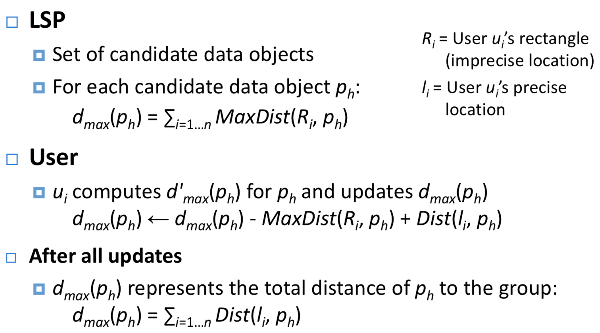

#   Mobile

[TOC]

- Mobile User Interfaces
- Mobile Games
- Sensors and Hardwares
- Location Privacy
- RFID
- Wireless sensor networks and mobile networks

## Overview

### Applications

- Digital purchases
- Mobile shopping
- Mobile advertising
- Information Management
  - access to information everywhere (stock, weather, news,...)

- Location-based services
  - connext-aware applications
- Mobile data management

### Futures

- Mobile banking
  - already on the go
  - Payments (digital cash, WeChat Pay, Alipay)
- Speech recognition
- Barcode reader (QR)
- Increase range of wireless services
  - WiMax
  - Peer to peer phones
- Integration with sensors
  - GPS, accelerometer, temperature,...
- Overcome limitations in screen size

### Operating Systems

- Symbian
- Windows Mobile
- Linux
- Palm OS (Dead now)
-  RIM (BlackBerry)
- Android 
  - Not an OS but a software stack that uses Linux
  - Dalvik virtual machine (Java)
  - WebKit (open source)
- iPhone OS

## Technologies

### Physical

- WPAN (Bluetooth)
- WLAN
- WAN
- RFID
- GPS
- Routing in MANETs
- Mobile IP

## Computing Paradigm

### Developing Software

#### [++] Web vs Native

| Web                                                          | Native                                                       |
| ------------------------------------------------------------ | ------------------------------------------------------------ |
| Create a web Service                                         | Develop application via SDK                                  |
| Client (include mobile device) access services via web browser | Deploy the app locally on a device and access services via apps |
| One code for all platforms                                   | Each platform must be cared separately                       |
| Responsible Web Design(响应式设计)                           |                                                              |
| 适用于: - 时间紧迫, 需要短时间内跨平台 - budget少的 - 互动不复杂的 | 适用于: - 对性能要求高的 - 使用很多sensors的       |

#### Design with all platforms considered

- High-level APIs
- Use platform-independent low-level APIs
- Responsiveness: Discover device capacities

## [+++] UI Design and UX (User eXperience)

### Principles

- KISS: keep it simple and stupid
  - simple and easy-to-use UI
  - Minimise user input
  - pre-selected likely choice
- Metaphors and skeuomorphism
  - 拟物风 
- Material Design
- Use side drawers  

 #### Tips

- Use side drawers (think off canvas)
- Springboards
- Card deck metaphor 
- Dashboard

### Design Cycle (steps)

#### 7 Stages of Action

1. Find the goal
2. From goal to execution
3. (User) Evaluation the design
4. Improvement

 

##### Gulf (gap?) of Execution (执行偏差)

> 使用者规划的行动和系统所接受的不一致

- the difference between the intentions and the allowable actions
- how directly can the actions be accomplished
- Do the actions that can be taken in the system match the actions intended by the person

###### 如何判断是不是好的Execution设计

> - user can tell what actions are possible
> - interface can help user map intention to physical movement
> - device can desily support required actions

##### Gulf (gap?) of Evaluation (评估偏差)

> 系统表现和使用者期待之间的差距

- workload to **interpret** the state of the system
- is the information easily accessible
- mismatch between the exception of users and the behovior of systems

###### 如何判断是不是好的evaluation

> - user can easily tell if the system is in the desired state
> - user can map the system state to an interpretation
> - user can easily tell what state the system is in

### UI Elements

Button, Stepper, Switch, Segmented, Checkbox, Popup Menu, (date) picker, UITextField, UITableView, UICollectionView, UILabel, UIImage

#### Text Input

- 12/9 buttons, QWERT keyboards, pen, voice, special hardwares
- Smart Watches: ZoomBoard, TouchOne, Touch-Sensitive Wristbands, Omnitouch

 

### [++]  Usability

| Name         | Description                                                  |
| ------------ | ------------------------------------------------------------ |
| Learnability | how easy for a user to learn                                 |
| Efficiency   | how quick can user perform a task                            |
| Memorability | how easy for a user to reuse it after quite a period of time |
| Errors       | how to serve errors and how easy can user recover from errors |
| Satisfaction | how pleasant is it for user to user this design              |

#### Key points

##### Meet expectation:

- match between system and the real world
- Help and documentation
- Consistency and standards

##### User is the boss

- User control and freedom (makes people feel the control, like loading icons)
- Visibility of system status
- Flexibility and efficiency of use

##### Handle errors

- Error prevention
- Recognition rather than recall
- Help user recognize, diagnose and recover from errors

##### Keep is simple (and stupid, KISS)

- Aesthetic and minimalist design (beautiful and simple design)

## Game development Process

### Classification Methods

- Cooperation
- Sum of choice
  - Zero-sum/non-zero sum
- Simultaneous/Sequential (Turn-based)
- Information
  - Perfect (All known)
  - Imperfect

- By View(First-Person, Third-Person, side scroller)
- By Type (Action, Adventure, Puzzle)
- By genre(Fantasy, sport)

### 5 planes(factors) for a game

- rule-based
- medicated
- fictional
- play
- social

### Game Design

#### Factors of a Game

| Factors       |                                                              |      |
| ------------- | ------------------------------------------------------------ | ---- |
| Semiotic      | A symbol or icon that represents sth (objects, players, npcs) |      |
| System        | - **Objects**: parts/elements/variables that within the system - **Attributes**: qualities or properties of the system or its objects - **Internal** Relationships: relations between objects - **Environment**: context that surrounds the system |      |
| Interactivity | - **Cognitive**: interpretive participation - **Founctional**: utilitarian participation - **Explicit**: participation with designed choices and procedures - **Beyond-the-object**: participation within the culture of the project |      |
| **Choices**   | - at micro level: each decision at its smallest level - at macro level: aggregated choices form a larger outcome - tactic (local planning): a cluster of choices - strategy (global planning): a sum of players' choices - outcomes depends on actions of the others (like your opponents) |      |

##### Implementing choices

- choice must have consequences (reflect for users' score or sth)
- avoid dominant choice
- cannot go back after consequences are applied

###### Importance of choices:

- critical: life or death
- important: direct or immedicate impact
- necessary: indriect or delayed impact
- minor: small impact (can be direct or indirect)
- without consequence

 ### Frameworks

#### MDA (Mechanices, Dynamics, Aesthetics)

- **Mechanics**: Rules and algorithms define the actions 

- **Dynamics**: Behaviour arising while players interact 

- **Aesthetics**: Experiences, emotions 

### Player analysis

#### Player type (Bartle’s Taxonomy of Player Type)

### Game design criticals

|              |                                                              |      |
| ------------ | ------------------------------------------------------------ | ---- |
| GDD          | Game Design Document                                         |      |
| Expectations | What Players want and they do not                            |      |
| Experience   | Find an idea of a game with a meanful plot to convey an experience: - **idea**: goals, constaints,Rules, rewards, styles, ... - **meanful**: Location, age, world, universe - **plot**: Comedy, overcoming a master, Romance, ... - **convey**: impression, reaction, feedback |      |

#### [+?] The polt

- Experience should not be linear
- 情节循序渐进, 高潮迭起, 刺激不断

#### The flow

- 难易结合, 有难的篇章/操作,也有白痴/简单的篇章/操作

> flow of the game should be traded off between challenges and skills (of players)
>
> eg: (the white road is "**flow channel**")
>
> | Distractions, no flow                                        | Flow, but too linear "run"                                   | Most interesting flow                                        |
> | ------------------------------------------------------------ | ------------------------------------------------------------ | ------------------------------------------------------------ |
> |  |  |  |
>
>

- Clear goals
- No distractions
- Direct feedback
- Continuously challenge

### Rules & Goals

略

### Aesthetics

| Factors         | Description                                                  |
| --------------- | ------------------------------------------------------------ |
| Style Guide     |                                                              |
| Curves & Ratios | - Fibonacci Curves - Golden Ratio - Golden Angle - Voronoi Cells - Fractals, L-Systems - Flow Simulations |
| **Colors**      | - Moodboards (mood board是指经由对使用对象与产品认知的色彩，影像，数字资产或其它材料的收集，可以引起某些情绪反应，作为设计方向与形式的参考。设计师运用它来检视色彩，样式，并据以说服其它人之所以如此设计的理由。其应用范围很广，可以用于接口设计，网页设计，品牌设计，营销沟通，电影制作，脚本设计，电玩游戏制作，甚至是绘图，室内设计等等。) |

### Realism

##### Problem: Uncanny Valley

人类(玩家)对机器人(游戏人物)在"拟人"水平达到100%之前的一小段时间突然产生强烈的厌烦.

> | Definition                                                   | Figure                                                       |
> | ------------------------------------------------------------ | ------------------------------------------------------------ |
> | 恐怖谷現象可以用以下想法解释，如果一個实体「不够拟人」，那它的类人特征就會显眼并且容易辨认，产生移情作用。在另一方面，要是一個实体「足够拟人」，那它的非类人特征就會成为显眼的部份，在人类观察者眼中产生一种古怪的感觉. |  |

### Game Technologies

#### Game Loop

#### Game API

| Element                | Description                                                  |
| ---------------------- | ------------------------------------------------------------ |
| GameCanvas             | ▪ Dedicated screen buffer (Graphics object) ▪ Supports incremental updates (instead of rendering entire frame) ▪ Flush graphics: display contents of the buffer |
| Layers                 | ▪ Sprites and tiled layers ▪ Can be visible or invisible |
| Screen Buffer & Layers |                                                              |
| Sprites                | A set of tiles is small; little memory required              |

#### Collision Detection

- Boundary-level (fast, like using a rectangle to represent a  sprite)
- Pixel-levle (precise but resource-consumption)

#### Features of mobile games

| Features             | Description                                                  |
| -------------------- | ------------------------------------------------------------ |
| Processing & Network | Less CPU power, (usually) no hardward acceleration, less memory, unstable networks |
| Hardware             | Input capabilities, screen size - touch screen: feedback, adjustable |
| Portabality          | **Sensors**: location, acceleration, camers **Context-awareness**: use environment as part of the game (AR) **Device as controller** Mixed reality games, location-based games |

#### Augmented Reality (AR)

- Mixed Reality(MR)

> 

## Sensors 

| Types                   |                                                              |                                                              |
| ----------------------- | ------------------------------------------------------------ | ------------------------------------------------------------ |
| Wearable Computing      |                                                              |                                                              |
| AR vs VR                |                                                              |                                                              |
| Internet of Things      | - Reliable and effective for IoT (No) - Data privacy is an important problem (access easily granted, ) | - Lightweight protocols - Network discovery - Scalability - Naming and addressing strategies - Dynamic routing |
| **Sensors**             | In the broadest definition, a sensor is a **device, module, or subsystem** whose purpose is to **detect events or changes** in its environment and **send the information to other electronics**, frequently a computer processor. |  Camera, GPS, Accelerometer, Fingerprint, Ambient light sensor, Magnetometer, Microphone, Barometer |
| Context-Aware Computing | Such context-aware software adapts according to thelocation of use, the collection of nearby people, hosts, and accessible devices, as well as to changes to such things over time. | Eg:  - An accelerometer to detect whether you are in a train, bus or car and do some task relevantly - light sensor (to adjust the light of the device itself) - Accelerometer for layout change(landscape or ...) |

## Location-based Services(LBS) & Location Privacy

**Definition: Services that integrate a mobile’s device location with other information** 

### Push vs. Pull

- **Push**: User receives information without an active request
- **Pull**: User actively pulls information from the network 

### Location Accuracy Level of Applications

| Accuracy Level          | Applications                                                 |
| ----------------------- | ------------------------------------------------------------ |
| High Accuracy           | - Asset tracking - Directions - Emergency          |
| Medium to high accuracy | - Advertising - Car navigation - POI (point of interest) |
| Low accuracy            | - Fleet management - News - Traffic Information    |

### Location Engine

- Geocoding (translate street address to latitude & longitude or vice versa)
  - could be difficult if not complete information available
- Routing & Navigation
  - Compute best route: A*, Dijkstra...
  - Best could mean: shortest, fasterst, simplest,...
- Proximity search
  - Spatial DBs: POIs such as ATMs, hotels, gas stations,...

### Location Privacy

- Location-based spam (email, ads)
  - Unsolicited advertising (Fackbook konws where you were !)
- Personal safety (celebrities positions were made public)
  - Stalking
  - Assault

- Intrusive inferences
  - Person's political views
  - Individual perferences
  - Health conditions

#### Sharing - Location obfuscate

##### Imperfect 

- Types:

> 

#### [++] How to protect your location privacy

| Method        | Description                                                  | Comment                                                      |
| ------------- | ------------------------------------------------------------ | ------------------------------------------------------------ |
| Stealth       | Ability to be at a location without anyone knowing you are there (Use of passive devices such as GPS) | - Active devices such as mobile phones cannot preserve stealth   - Access of information overrides stealth |
| K-Anonymity   | https://www.zhihu.com/question/26710204 (k-anonymity指的是除非有k-1个人的数据同时被公布，才可能推断出第k个人是谁) | - quasi identifier                                           |
| Cloaking      | - 降低精度 - Reduce the frequency of temporal information  | - split people in the system, until we have ***k*** persons in an area and use that location to represent you (这样的话, 只有同时识别k-1个人是谁, 才能分辨出来你是哪个) |
| L-Diversity   | - persons with same non-sensitive fields combination have different sensitive fields (增加数据的丰度,使得具有相同分类的non-sensitive出现尽可能多种类的sensitive) |                                                              |
| Decentralised | - limitations of centralised: communication overhead, security risks, single point of failure - LCA: locally cloaked area - GCA: globally cloaked area  | See detail below                                             |
| *k-GNN*       | - find the place that sum the distances to all users of a group - **distance intersection attack**: if someone knows the distances from one user to 3+ places, then the accurate location of that user can be calculated out.(use aggregate information) |  |

##### Decentralised

**Principle:** 

1. initiator: create request and encrypt request via public key (**using LCA to hide the precious location of itself**)
2. agent: initiator sends request to agent, agent sends it to LBS provider (**using GCA to decrease precious location of itself)**
3. LBS provider(eg, google): dencrypts the request and encrypts response via initiator's public key, and sends it to agent
4. agent sends responses to all devices of an area
5. only initiator can read the response (as only initiator has the private key to dencrypt the response)

|                       |                        |                                                              |
| --------------------- | ---------------------- | ------------------------------------------------------------ |
| LCA                   | locally cloaked area   | - Parameter affecting ratio of length and width - Parameter for the agent’s position relative to area’s boundary |
| GCA                   | Globally Cloaked Area  | Find the minimum bounding box of a k-subset (including the agent’s own LCA) from n possible LCAs  - Green area is the LCA of the user - Dot black rectangle is the GCA |
| Approximating the GCA |                        | - Red rectangle is the LCA - Whole grey area is different GCA stages 1. find the edge that has the max distance to the LCA edges 2. remove the rectangles which have the edges that selected from step 1 3. Find the GCA that can cover all left LCAs (white area as below).  |
| Random selection      | How to select an agent | - Initiator selects one device A - Device A selects one device B - B actually sends the request |

##### Whole step

 

#### Location attacks

| Attack Type                           | Description                                                  |                                                              |
| ------------------------------------- | ------------------------------------------------------------ | ------------------------------------------------------------ |
| Query Sampling Attack                 | Can easily find a user (eg, A) from several different regions' user set information | (User A can be easily outleted) |
| Query Tracking Attack                 | - Assumptions: continuous queries, some unchanged identity key  - Track the path of a user, which may be used to find out the destination of that user (using intersection) |  |
| Maximum Movement Boundary(MMB) Attack | - Assumptions: continuous queries, unchanged identity key between two consecutive queries - Can be used to fidn the approximate location of that user |  |
| Query Trajectory Attack               | - Assumptions: continuous queries, continuous updates to ensure result is correct - Can be used to intersect rectangles of two consecutive updates to
refine the user location |  |
| Context Inference(outdoor/indoor)     | - to get the transportation of a user - prediction user's future route(based on history) - predict home address/current location - predict user's properties(age, work role, coffee/tea drinker, smoker...) |                                                              |
| Protect your trajectory               | Moving kNN Queries - moving k nearest neighbours queries - Risk: track user's trajectory | parameters:  - k: the bigger the less accurate     |

#### Metrics for Location Privacy

| Nouns             | Definition                                                   | Comments                                                     |
| ----------------- | ------------------------------------------------------------ | ------------------------------------------------------------ |
| Anonymity Sets    | The set of all possible subjects who might cause an action.  | - The larger the size of the set, the greater the anonymity (eg, k-anonymity)   |
| Obfuscation Sets  | The locations from which a user’s position is indistinguishable/indiscernable | - The larger the size of the set, the greater the location privacy |
| Distance Measures | Location privacy is the distance between a user’s location   |                                                              |
| Entropy(熵)       |                                                              |                                                              |

#### Navigation under imprecision

| Strategy             | Solution Description                                         | Comments                                                     |
| -------------------- | ------------------------------------------------------------ | ------------------------------------------------------------ |
| Contingency Strategy | 1. 找到更可能的path 2. 尝试多条路线, 返回选择次数最多的routes | - in general, not the shortest path is selected - use Dijkstra |

### Negative Information

Negative representation of data

> Eg:
>
> 

#### Applications

- Discovering movement patterns in shopping malls
- Monitoring traffic
- Number of distinct entries to a shopping mall
- Traffic between two suburbs

## RFID (radio frequency identification)

- Tag Types

  > - Passive: No battery
  > - Semi-passive: Circuit is battery-powered except communication
  > - Active

- Reader: query tags via radio signals

### Working steps

1. Reader (base station) sends a radio **interrogation signal** 
2. RFID **tag** backscatters its ID 
3. **Proximity-based** technology: determine the tag location by measuring the signal’s **time of flight** (in theory) 

### Characteristics

- No **line-of sight** necessary (in contrast to barcodes) 
- **Resist environmental conditions**: frost, heat, dirt, ... 
- RFID **tags** with **read & write memory** (nonvolatile EEPROM) 
- Smartcard functionality (JavaCard): **cryptographic** computations for personal contact cards 
- Data Rate: 9.6 –115 kbit/s
- **Reader**: simultaneous detection of up to 256 tags, scanning of up to 40 tags per second
- **Response time** of an RFID tag: less than 100 milliseconds
- **ID**: 64, 96 , and up to 128 bits

| Mode    | Operation                                                    | Feature                                                      |
| ------- | ------------------------------------------------------------ | ------------------------------------------------------------ |
| Passive | - Do not need an internal power source   - Operating power is **supplied by the reader**   - Electrical current induced in the tag’s antenna by the radio signal pulse of the reader | - Can be used for distances of **up to 3 meters**   - Can be very small: 0.15 mm × 0.15 mm, 7.7μm thick (RFID powder, mu-chip from Hitachi)   - Very **cheap** (a few cents) |
| Active  | - Own power source (battery life expectancy: up to 10 years) | - Cost: a few dollars  - Size: as small as a small coin   - Support read ranges up to 100 meters   - Deployment in more **difficult** RF situations (water)   - Tags have typically **a higher scanning reliability**   - Combination with sensors (vibration, light, humidity, ...) |

### RFID Frequency

| Type                      | Range                            | Description                                                  |
| ------------------------- | -------------------------------- | ------------------------------------------------------------ |
| LF: low frequency         | 125 – 134.2 kHz, 140 – 148.5 kHz | - Good materials for water and metal (with hight go-through ability)  - Widely adopted (and used longer than HF)   - No collision protocol available (see later)  - Typical read range: **30cm** |
| HF: high frequency        | 13.56 MHz                        | - Provides anti-collision protocols - Up to **1m** read range |
| UHF: ultra-high frequency | 868 – 928 MHz                    | - Difficult to penetrate of water and metal (similar to light) - Read range: up to **3m** |
| Microwave or UWB          | 2.4 – 5.8 GHz or 3.1 – 10 GHz    | - Read range: up to **2m** (projected up to **200m for UWB**) - High data rate |

#### Anti-Collision & Singulation

Used to solve collision problem (a read receives signal from sevaral different tags at the same time)

##### Anti-Collision: trade time for the possibility to interrogate all tags

##### Singulation: identify(iterate through) all tags 

### Protocols

| Protocol             | Comment 1                                                    | Comment 2                                                    |
| -------------------- | ------------------------------------------------------------ | ------------------------------------------------------------ |
| ALOHA                | - **“Tag-Talks-First”** behavior: **tag** automatically sends its ID (and data) if it enters a **power field**  - If a message **collides** with another transmission, **try resending** it later **after a random period** - Collision Types: Partial or Complete  - throughput: **18.4%** | Reduce collision of ALOHA - **Switch-off**: After a successful transmission a tag enters the quiet state  - **Slow down**: Reduce the frequency of tag responses  - **Carrier sense** : 1. No carrier sense possible (tags cannot hear each other); 2.Use **ACK signal** of the reader in communication with another tag; 3.Reader **broadcasts** a **MUTE** command to other tags if it interrogates one tag |
| Slotted ALOHA        | - **"Reader-Talks-First"**: Use discrete timeslots (SOF, EOF) - **A tag can only send at the start of a slot** - **only complete collision** - "Early end" - **throughput**: 36.8% |                                                              |
| Frame-slotted ALOHA  | - Group several slots into frames - Only one tag transmission per frame - Limits frequently responding tags - Adaptive version: adjust the number of slots per frame |  |
| Binary Tree Protocol | - Tree traversal algorithm (**depth first search**) - "Reader Talks First", reader **boardcast** a request command with an ID as parameter - Only tages with lower or equal ID respond - tag is **remained quiet**(do no respond) if the tag is not the target one - **repeat** until no collision occurs or all tags are quiet |  |

### Pros and Cons

| Advantages                                        | Disadvantages                                                |
| ------------------------------------------------- | ------------------------------------------------------------ |
| Very cheap, high volume, large variety            | No quality of service                                        |
| Long industry experience                          | Only passive data acquisition (asymmetric communication)     |
| Scanning even with high speeds possible (300km/h) | Possible interference with ISM bands                         |
| No maintenance, simple to manage                  | No authentication: - Readers can not sense tags if they do not reply - Tags reply to any reader |
|                                                   | No encryption: - Evaesdropping possible                 |
|                                                   | Man-in-the-middle attack                                     |

### Applications

##### Summary

| Type           | Example                                                   | Risk                               |
| -------------- | --------------------------------------------------------- | ---------------------------------- |
| Alerting       | - Payment: RFID smartcards and electronic toll collection | - Security risk: denial of service |
| Authentication | - E-passport and car keys                                 | - Security risk: forgery           |
| Identification | - Like barcodes but more data and faster to process       | - Privacy risk: sniffing           |
| Moiniting      | - Product tracking and inventory management               | - Privacy risk: tracking           |
|                |                                                           |                                    |
|                |                                                           |                                    |

### Privacy

- Unauthorized surveillance/monitor
- Potential risks
  - mis-scanning high value goods

##### How to deal with them:

- Killing (tag deactivation)
  - damage the tags so that they cannot be used for furture usage (return defective goods, airline tickets)
- User intervention
  - Provide a button for user to press before reading tag(No protection against passive eavesdropping)
- Silencing: metal lining
  - Make radio of readers/tags do not work in some environment (RFID Blocking Passport Case)

- Active jamming

  - Device that broadcasts radio signals to block/disrupt RFID (make them unavailable)

- Hash-locking

  - lock tags with a mete ID y
  - unlock by a one-way function (*y=h(x)*)
  - Expensive since cryptographic operations are required 

- Encrypting: silent tree walking

  - Encrypt readers transmission: a passive eavesdropper cannot infer the tag IDs 

- One time identifiers (pseudonym rotation) 

  - Works only for tree-based scanning algorithms 
  - A blocker tag forces a reader to sweep the very large space of all possible tag identifiers 

- HIdden-blocker tags (used to protect your bank card in your pocket)

- Keyless “Encryption”

### RFID Authenticity

### Threats

- Cloning: copying existing tags
- Forgery: creating new tags with a valid identity
- Relabeling

### Track & trace

- Application anticipates tag movements, detects and reports  anomalies and duplicates 
- Can protect both threats but with hindsight (after bad things)

#### How to solve

- Static authentication
  - using digital signature
  - Protects against forgery, but not cloning
- Static authentication with public-key protocol
  - Tag authenticates reader by public-key protocol
  - Encrypts digital signature with reader’s public key

### Security Schemes

- Rolling code schemes (cheap)
- Challenge-response protocols (expensive)

### RFID Rights of consumers

- To know whether products contain RFID tags 
- To have RFID tags removed or deactivated when they purchase products 
- To use RFID-enabled services without RFID tags 
- To access an RFID tag's stored data 
- To know when, where and why the tags are being read 

###  RFID Future Directions

- Super-distributed RFID infrastructures
  - Massive number of tags are placed on an object
  - Applications:
    - Indoor localization and positioning
    - Collaboration
    - Distributed storage of information

## Networks

### Benefits of Digital signals

- Efficiency
  - Higher data transfer than analog networks 
  - Enables compression for higher efficiency 
  - Smaller power consumption 
- Security
  - Simple eavesdropping for analog signal (even for encrypted signals)
- Degradation and restoration (Error correction)
- Error detection
- Features
  - Caller ID and call answer, Data traffic 

### 

### Switch

- Circuit switching
- Packet switching

### Signal Propagation (distance ? )

- **Transmission range**: Communication with low errors
- **Detection range**: Detection but no communication (or with too many errors)
- Interference range: Signal cannot be detected or signal is part of the  background noise 

###  Issues in Wireless Transmission

- Problems for wave propagation
  - 反射(reflection): Large objects
  - scattering 
  - 衍射:signal deviation (diffraction) 
  - 折射:signal change and reflection (refraction) 

- Multipath propagation
  - Signal takes different paths between sender and mobile device 

### Multiplexing

- Transmission Range

### [++] Multiplexing

**Guard spaces**

- Gap( can be time/frequency/code difference) between to two channels

- Reduce risk of interference between channels

| Type                 | Definition                                                   | Advantages                                                   | Disadvantages                                                |
| -------------------- | ------------------------------------------------------------ | ------------------------------------------------------------ | ------------------------------------------------------------ |
| Space (SDM)          |                                                              | Space channels physically apart to avoid interference        | Graph coloring problem(how to select channel between tow cells) |
| FDM                  | Frequency Division Multiplexing                              | - No dynamic coordination required - Can be used for analog networks | - waste of bandwidth if traffic distributed unevenly - Guard Spaces |
| TDM                  | Time Division Multiplexing - A channel gets the whole spectrum for a short time - All channels use same frequency at different times | - High throughput for many channels                          | - Precise clock synchronisation                              |
| Combine of FDM & TDM | Each channel gets a certain frequency band for a certain amount of time | - Higher data rate - more robust                        | - Precise clock synchronisation                              |
| CDM                  | Code Division Multiplexing - Each channel has a unique Code - Channels are separated by codes, with guard spaces | - No coordination and synchronisation is required - Bandwidth efficient | - Lower data rate                                            |

### WPAN Standards

#### Body Area Networks

- Use natural electrical conductivity of the human body to transmit electronic data (2.4 KB/s up to 400 KB/s )
- Applications:
  - Car or phone recognizes a user
  - Pay by touching a device in a bus
  - Device configures itself through touch

#### Ultra Wide Band

- Radio always transmits at 640 Mbps but maximum actual data rate is 480 Mbps due to error correction 
- Applications: 
  - Short distance compressed video transmission 
  - Wireless printing and monitors
  - [future] Precise location system and real time location system
  - [future] Precision radar imaging technology, even through walls 
- Security
  - Stronger security than Bluetooth and WLAN 
  - All devices have unique IDs 
  - Cryptographic sequence number (avoid replay attack)

#### Bluetooth (802.15.1)

- Goal
  - **Ad-hoc** wireless connectivity for electronic devices
  - Low-cost replacement for wires

- Features
  - Short-range: 10 m – 100 m 
- Networking
  - Point to point 
  - Point to multipoint (up to 8 devices)

### [+++] Routing

## Challenages

### (Wireless) Communication 

- More frequent disconnections
- Lower bandwidth
- Higher Latency
- Variation in available bandwidth
- Complex network typology 
- Increased risk

### Mobility

- Address Migration
  - Mobile divices use different (IP) address
  - Selective broadcast, central services, home base, forwarding pointers
- Location Dependent Information
  - Information request depends on the location of devices
- Migration Locality
  - Connections should be automatically migrated to a closer server (geographically) 

### Portability

- Energy

  - Batteries - ~= 20% weights of a mobile device
  - Power consumption ~= $CV^2F$
    - $C$: capacitance can be reduced by **VLSI (??)** design
    - $V$: can be reduced by smaller structure
    - $F$: clock frequency

- Risk to data

  - easier to loos or damage in mobile devices

- Resource-poor related to static devices that have the same budget

### Social Impact

- Privacy
- Security
- Behavior

