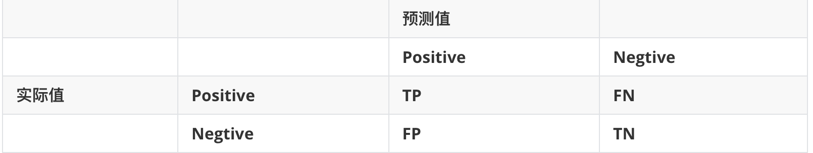
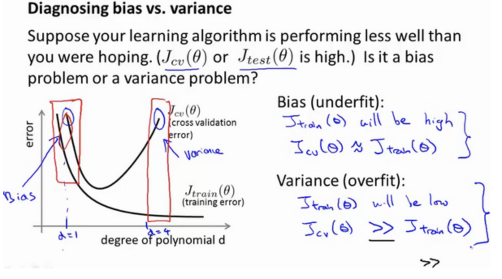
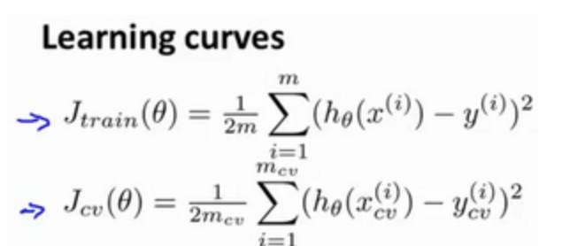
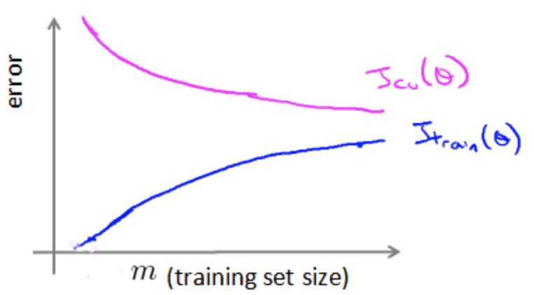

# 算法设计

## 算法设计步骤

1. 收集数据

2. 转化数据

3. feature分析/提取

4. 模型选择

5. 设定误差分析的指标 (不同问题measure方法不同,重点也不同)

   > 

   - precious ($\frac{TP}{TP+FP}$)  VS recall ($\frac{TP}{TP+FN}$)

6. 迭代优化

## 欠拟合(underfit)于过拟合(overfit)

### 如何识别bias(underfit) and variance(overfit) 问题

- 通过error

- 通过学习曲线 - learning curve

|                                                              |                                                              |
| ------------------------------------------------------------ | ------------------------------------------------------------ |
|  |  |

## 6种优化算法的方式

| Action                                     | 解决的问题              |
| ------------------------------------------ | ----------------------- |
| more training sample                       | high variance (overfit) |
| less features                              | high variance (overfit) |
| more features                              | high bias (underfit)    |
| more complex model                         | high bias (underfit)    |
| reduce regularisation (small $\lambda$)    | high bias (underfit)    |
| increase regularisation (bigger $\lambda$) | high variance (overfit) |

