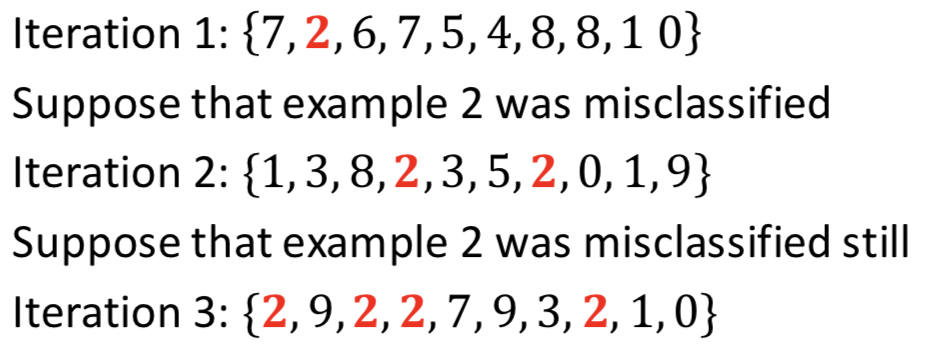
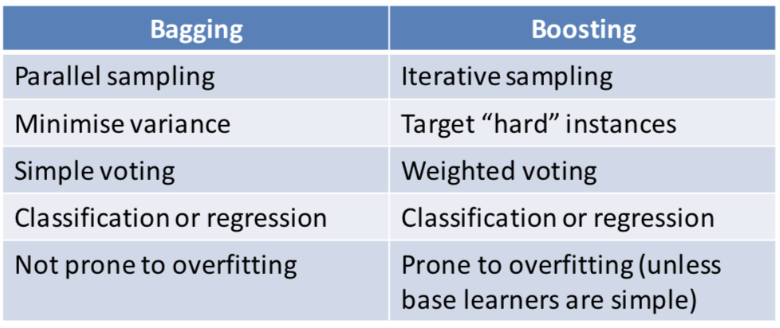
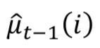

# Machine Learning


[TOC]


## 模型分类

- 判别模型(discriminative model): 通过模型直接得到类别
- 生成模型(generative model): 每个分类一个概率, 选概率高的

> 判断一个动物是大象（y=1）还是小狗（y=0）。
>
> - 判别模型:
>
> > 从训练数据中学习得到判别大象和小狗的决策面（decision boundary），有了这个决策面之后，如果需要分类一个新动物是大象还是小狗，只需要判断它在决策面的哪一边。
>
> - 生成模型:
>
> > 先观察大象，根据其特征学习一个大象的模型，同样的我们学习得到一个小狗的模型。当我们判别一个新动物时，分别和大象模型和小狗模型比较，哪个动物更像就认为新动物为那个类。


## Liner Regression


### 代价函数解法

#### 1.  最小二乘法(Least Squares => normal equation 即正规方程) (Analytic(aka closed form,解析解)solution)


#### Steps: 


#### 2. 梯度下降 (Approximate iterative solution)


#### Steps:


## Logistic Regression

- L1 norm: Manhattan Distance
- L2 norm: Euclidean distance

- Decision Boundary ( 一般是 p(1|**x**) = 0.5时的 **x**所对应的boundary来区分 )

|  |  (圆点在原点且半径为1的圆形) |
| ------------------------------------------------------------ | ------------------------------------------------------------ |
|  |  |


|                   |                                                              |
| ----------------- | ------------------------------------------------------------ |
| Original Equation |  |
| Hence             |  |
|                   |                                                              |
|                   |                                                              |


#### Training as Max Likelihood Estimation

##### Iterative optimisation

- Bad news: **No closed form solution(解析解)**
- Good news: Problem is **strictly convex** (like a bowl, 凸函数) if there are no irrelevant features --> 
  optimisation guaranteed to work! (using **regularisatoin** to deal with irrelevant features)


#### Training as cross‐entropy minimisation

| for a single data point                                      | for data set                                                 |
| ------------------------------------------------------------ | ------------------------------------------------------------ |
| <br />即<br /> |  |


## Basis expansion

### Marry non-liner data to a liner method

#### Transform the data (map data onto another features space)


###  Radial basis functions(RBFs)

A **radial basis function** is a function of the form 


Where z is a constant


### Challenges 

- the transformation needs to be defined beforehand
  - can choose uniformly spaced points **or** cluster training data and use cluster centroids
  - popular idea is to use training data $z_i \equiv x_i $
    - results in a large number of features


### How to improve (futher directions)

- learn transformation function from data (ANN)
- kernel trick(kernelised methods)
- sparse kernel machines (SVM, training depends only on a few data points)


## Regularisation

用来解决ill-posed(结果不唯一/不稳定 ==> input干扰导致结果变化剧烈)和过拟合(overfitting)


- $\lambda$    被称为 regularization parameter


### 要解决的问题

**overfit**


#### 不相关feature (Irrelevant features)

当feature $X_j$ 是是其他features的某种函数得到的, 那么就feature $X_j$ 就是irrelevant feature


**数据缺失 (Lack of Data)**

例子是Model参数比data instances count还多


#### ill-posed problems

- 结果不唯一/不稳定 ==> input干扰导致结果变化剧烈
- **例子**: 正规方程求 $\theta$ 的时候,  $X'X$没有逆


 ### Solution - Regularisation

#### 使用regularisation, 引入**additional condition**

| Original Loss Function (maximum likehood estimation, MLE)    | After regularisation (maximum a posteriori, MAP)             |
| ------------------------------------------------------------ | ------------------------------------------------------------ |
|  |  |

此时正规方程解法的公式为 **(ridge regression - 岭回归)**:


#### 推导: 

Slide 05. p16


### 如何选择model

#### Explicit model selection

- 尝试
- 测试(evaluate)
- 比较
- 选择


#### Vary complexity by regularisation

- 转化问题(augment the problem, by 加入regularisation factor), 例如上面提到的ridge regression(岭回归)


- 根据$R$ 计算/evaluate/compare 并最终选择 $\lambda$


### 不同Regularised方式的 Liner Regression 对比


## Bias-variance trade-off

### 什么是Bias和variance

##### - Bias: 在样本上拟合的好不好

##### - Variance: 模型在测试集上的表现好不好


- complexity model

  - 负责的model通常可以让 training error变得很小
  - 甚至是0 error(有限sample的时候)

  |               |           |               |
  | ------------- | --------- | ------------- |
  | simple model  | High bias | Low variance  |
  | complex model | Low bias  | High variance |


### bias, variance和test error以及underfit/overfit的关系

|                                                              |                                                              |
| ------------------------------------------------------------ | ------------------------------------------------------------ |
|  |  |


## Perceptron (感知机, 神经网络基础)

- activation function
- feed forward networks

#### Convergence Theorem: 

```
if the training data is linearly separable, the algorithm is guaranteed to converge to a solution. That is, there exist a finite 𝐾 such that L(w^K) = 0
```


#### Update $w$  in training

 


## Multilayer Perceptron 


#### Activation Funciton


#### Loss funciton


- differentiable
- no analytic solution (通常没有解析解)
- 使用stochastic gradient descent算(随机梯度下降, 每次更新$\theta$只用一个sample) - 对比批量梯度下降, 每次更新使用全部sample


## Backpropagation ( of errors)

- 从最后一层向前(偏导)
- 正则化(regularisation, implicit and explicit)


## Deep learning

- Any Boolean function over 𝑚 variables can be implemented using a hidden layer with up to 2􏰎 elements 
- **vanishing gradient problem**

> **原因：**前面层上的梯度是来自于后面层上梯度的乘乘积。当存在过多的层次时，就出现了内在本质上的不稳定场景，如梯度消失和梯度爆炸。
>
> https://blog.csdn.net/cppjava_/article/details/68941436


### Convolutional Neural Networks(CNN)

### Components of a CNN

- Convolutional layers
  - complex input representations based on convolution operation
  - filter weights are learned from training data
- **Downsampling (usually via Max Pooling)**
  - re-scales to smaller resolution, limits parameter explosion
  - Max Pooling: 
    - $v = max(u_{11},u_{11},...,u_{mm})$ (选择卷积中的最大valuable的那个)
    - invariance(不变性)，这种不变性包括translation(平移)，rotation(旋转)，scale(尺度)
    - 保留主要的特征同时减少参数(降维，效果类似PCA)和计算量，防止过拟合，提高模型泛化能力
    - https://www.zhihu.com/question/36686900
- Fully connected parts and output layer
  - merges representations together


## Support Vector Machines

https://zhuanlan.zhihu.com/p/31258516


### Difference between SVM and perceptron

- Perceptron: min perceptron loss as studied earlier
- SVM: different criterion for choosing parameters


### Maximum margin classifier

- perpendicular to(垂直于)

- 最优boundary有无限个(有歧义的, ambiguity, 当 **$w$** 和$b$都是整数倍, 实际上是一条线,但是有无数种表示方法)

  - 解决方案1: measure the distance to the closest point, and rescale parameters(从而使解变得唯一):

  > **Steps:**
  >
  > 


### hard-margin SVM


### Soft-margin SVM

3 approaches to address ***not-separable*** problem

- transform data (still use hard-margin svm)
- relax the constraints
- combination of above 2 approaches


#### Relax the contrains: allow points to be inside the margin or even on the wrong side of the boundary (但是会加入“惩罚”机制)


| Hard Margin                                                  | Soft Margin                                                  |
| ------------------------------------------------------------ | ------------------------------------------------------------ |
|  |  |
| 其实就是soft margin中正则化常数C的倒数($\frac{1}{\lambda}$)无限大, 使得其第二项对错误分类的容忍度变得极小(既不允许错误), 容易出现**overfit** | C越小, 对错误的容忍度越大(既允许错误), 容易出现**underfit    |
|                                                              |                                                              |


### 解法

- 无约束的优化问题: $min f(x)$
- 带等式约束的优化问题:  $minf(x), s.t. h(x)=0$  (Lagrangian Duality)
- 带不等式约束的优化问题: $min f(x) , s.t.h(x) \leq 0$ (KKT )


### 核函数 (for non-liner data, feature space transformation)

- Map data into a new feature space
- run hard-margin or soft-margin SVM in new space
- decision boundary is non-linear in original space


#### 高斯核函数

- 地标 (landmarks)
- **Gaussian Kernel**
  - 较大时，可能会导致低方差，高偏差(bias, underfit)；
  - 较小时，可能会导致低偏差，高方差(variance, overfit)

> 

- 多项式核函数（**Polynomial Kerne**l）
- 字符串核函数（**String kernel**）
- 卡方核函数（ **chi-square kernel**）
- 直方图交集核函数（**histogram intersection kernel**）


### Logical regression vs SVM

$n$为特征数，$m$为训练样本数。

- $n > m$   ==> LR or SVM without kernel
- small n(1-1000) and not that big m(10-10000)  ==> SVM with Gaussian kernel
- small n and big m  ==> 找到更多features, 并使用第一种


### Representer theorem

一个用来识别新方法(learner)是不是有效的核函数的tool

**(Tells us when a (decision‐theoretic) learner is kernelizable)**

- $f$ function is a reproducing kernel Hilbert space(RKHS)


## Constructing Kernels

### Polynomial kernel


- Here 𝒖 and 𝒗 are vectors with 𝑚 components 
- 𝑑 􏰆 0isanintegerand𝑐 􏰆 0isaconstant 


### Identifying new kernels

#### Method 01


#### Method 02

Using **Mercer’s** theorem

using function $f$ to generate a matrix of $n * n$ size (each item = $f(a_i,a_j)$) and if the matrix is **positive-semidefinite**, then it is a valid kernel function.


Example: 证明Gaussian Kernel是一个核函数


> 最后一步的说明(根据method 01的identity):
>
> - 点乘是核函数(d次方的dot product)
> - 核函数乘以常数($r_d$)还是核函数
> - 核函数相加还是核函数
> - 核函数前后乘以$f(u), f(v)$仍然是核函数
>
> ===> 所以整个中间项是核函数


## Ensemble Methods (集成学习)

###  Bagginng

- Construct "near-independent" datasets via sampling with replacement(有放回的重复抽样, 每次取样后样品不会被drop, 仍然在取样空间中)
- sampling - training - predicting - evalucating 
- 可并行
- 解决high variance(overfit)的问题


#### Sampling

| Original training set                                        | Samples (with replacement)                                   |
| ------------------------------------------------------------ | ------------------------------------------------------------ |
|  |  |

#### Example: Random Forest (bagging的典型算法)


> 每棵树的features都是不同的 (也有说每个node的feature都是不同的)

 ##### 使用out-of-sample data进行测试

> 理论上, 当样本足够多的时候, 每条样本都有$e^{-1}=0.368$的概率不被选到.
>
> 这部分数据叫做 out-of-sample data, 可以用来做evaluate


### Boosting

- 解决high bias(underfit)的问题
- 有放回的抽样(但是基于weight选择, 不是random)
- 适用于分类器是“**弱(weak)分类器**”(容易underfit)
- 基于迭代(iteration), 每次迭代选择样本的时候,基于之前迭代结果得到的**权重(weight)**
- 计算量比bagging大
- 容易overfit (所以只适用于弱分类器, 也就是容易underfit的分类器; 如果使用performance较好的基分类器就更容易overfit)


#### Sampling

| Original                                                     | Boosting (more likely to select the ones that are misclassified) |
| ------------------------------------------------------------ | ------------------------------------------------------------ |
|  |  |


#### Steps


#### Example: AdaBoost


#### Bagging vs Boosting




#### Stacking

有点像ANN, 根据base model的output再次生成meta-model,类似于给每个base model一个权重(linear regression)

 $meta\_model=f(base\_models)$

- 计算量大 (computationally expensive)
- 可以使用多种base model


## Bandit

### MAB(Multi-armed bandit)

##### $\epsilon-Greedy $

- use $\epsilon $(0~1) to control exploration and exploitation
- trade-off between exploration and exploitation (using $\epsilon$) 
  - greedy($\epsilon=0$): increases fastest
  - high exploration (high $\epsilon$): increases faster
  - high exploitation (low $\epsilon$): increases slower, but eventually superior to high $\epsilon$.
- selection of initialisation value for Greedy ($\epsilon = 0$) (of estimate value Q)
  - Pessimism(悲观): 使用比观察值小的 --> 永远只选一个arm 
  - Optimism(乐观): 使用比观察值大的 --> 尝试所有arms


##### UCB (Upper Confidence Bandit)

UCB algorithm

|                                                              | Average Reward                                               | regretbounds                                                 |
| ------------------------------------------------------------ | ------------------------------------------------------------ | ------------------------------------------------------------ |
|  |  |  |
|                                                              | <br />前t-1轮的平均reward | <br /><br />这一整项代表一个加权, 被选择次数越少的arm这一项就越大, 也就越有可能被explore.<br />也就是说这一项是用来平衡exploration和exploitation的 |

###### Flexible change

Using $p$ to replace $2$ in the second part for the reason of balancing the weight of **selecting existing best one** or **exploration**.


## Unsupervised Learning

### Tasks

- Clustering
- Dimensionality reduction
- Learning parameters of probabilistic models

### Applications:

- 商品关联性分析(物品总是被一起买, 啤酒尿布)
- 奇异值检测(诈骗识别, 信用卡盗刷识别)


### K-means clustering


## Gaussian Mixture Model (GMM)

clustering问题转化


- 无法求导
- log trick后求导也不信
- 偏导也不行, 因此梯度下降不行
- **只能用Expectation Maximisation(EM)**


### Expectation Maximisation

| MLE                                                  | EM                                      |
| ---------------------------------------------------- | --------------------------------------- |
| a frequentist principle                              | an algorithm(求解MLE的)                 |
| maximise the probability of the data                 | a way to solve the problem posed by MLE |
| can be solved by other methods like gradient descent |                                         |
|                                                      |                                         |

#### 为什么要用EM算法

1. 没有足够的已知量来计算
2. 计算很麻烦


#### EM的主要思想

- 将变量分为$observed$  variables和*unobserved* variables (latent variables)

- 加入额外的冗余变量(additional variables might seem redundant)

- maximising 下限

  

> **key idea: 使用$\theta$ 来表示$p(Z)$**
>
> 右边部分就是EM的下限. 提高下限也就是提高右边部分的值.
>
> - 0. 右边部分是一个关于**两个**变量的函数, 无法同时求解, 因此使用**控制变量** (先固定$\theta$算$p(Z)$, 在固定$p(Z)$算$\theta$).
>
> - 1. 当set $p(Z) = p(Z|X,\theta^*)$时, lower bound becomes tight 
> - 2. lower bound的第二项是与$\theta$无关的
> - 3. 满足step1,2, lower bound就是一个关于$\theta$的一元函数, 就可以求解析解了


### GMM中的EM

Step E (Expectation)


Step M (Maximisation)


#### responsibilities


#### K-means是一种特殊的GMM(条件受限)

k-means是每个高斯分布的权重都是$\frac{1}{k}$ 的GMM


## PCA

reduce count of dimensions via data transformation


### 应用场景

假使我们正在针对一张 100×100像素的图片进行某个计算机视觉的机器学习，即总共有10000 个特征。

> 1. 第一步是运用主要成分分析将数据压缩至1000个特征
> 2. 然后对训练集运行学习算法
> 3. 在预测时，采用之前学习而来的将输入的特征转换成特征向量，然后再进行预测
>
> 注：如果我们有交叉验证集合测试集，也采用对训练集学习而来的。


#### 错误用法

- 用于减少过拟合
- 滥用 (尝试算法之前总是先进行PCA, 这可能会丢掉一些重要的feature)


## BayesianRegression

1. 假设先验概率 prior
2. 训练过程中得到后验概率 posterior


