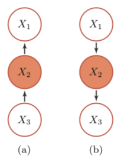

# Summary

[TOC]

## 名词

- 积分: integral
- 微分: differential
- 导数: Derivative
- 逆: inverse
- 转置:Transpose
- 协方差矩阵:covariance matrix
- 共轭: 
- (随机)梯度下降: (stochastic) gradient descent

## Model 类型

| Model Name       |                |      |
| ---------------- | -------------- | ---- |
| PGM - Directed   | Discriminative |      |
| PGM - Undirected | Generative     |      |
|                  |                |      |

## 概念

##### point estimate

- MLE: maximisation likelihood estimation 
- MAP: maximisation a posterior 

##### Cross validation (heldout)

##### chain of probility

- $Pr(X1,...,Xk) = 􏱾\prod^k_{i=1} Pr(Xi | Xi+1,...,Xk)$

- For any joint likelihood, and ordering on the random variables, expansion of joint as product of conditionals of each random given variables coming after (alternatively: before) in ordering. 

##### maximum-likelihood principle

Choose values in the tables that maximise the likelihood of the data. 

##### Step/Sigmoid Function

##### Independent and conditional independent

- Independent: 事件独立时，联合概率等于概率的乘积, $P(X,Y)=P(X)P(Y)$
- conditional independent: X 与 Y 是条件独立的当且仅当 $X⊥Y|Z⇔P(X,Y|Z)=P(X|Z)⋅P(Y|Z)$

> 也即 X 与 Y 的依赖关系借由 Z 产生。
>
> 例如，定义如下事件：
>
> - X：明天下雨；
> - Y：今天的地面是湿的；
> - Z：今天下雨了；
>
> Z 事件的成立，对 X 和 Y 均有影响，然而，在 Z 事件成立的前提下，今天的地面情况对明天是否下雨没有影响。

|                                                              |              |                                                              |
| ------------------------------------------------------------ | ------------ | ------------------------------------------------------------ |
|  | 间接因果关系 | X1 and X3 are conditional independent given X2               |
|  | 共因关系     | - X1 and X3 are not independent if X2 is unkonw - X1 and X3 are conditional independent if X2 is konwn |
|  | 共果关系     | - X1 and X3 are independent if X2 is unkonw - X1 and X3 are not independent if X2 is konwn |
|                                                              |              |                                                              |

##### Bayesian inference 

- weights with a better fit to the training data should be more probable than others 

- make predictions with all these weights, scaled by their probability 
- More robust predictions
  - less sensitive to overfitting, particularly with small training sets
  - can give rise to more expressive model class (Bayesian logistic regression becomes non‐linear!)

##### marginal likelihood

- Acceptable: the joint likelihood of the data and prior, after marginalising out the model parameters.
- Acceptable: $p(x) = 􏱿 \int p(x|θ)p(θ)dθ$ where x is the data, θ the model parameter(s), and p(x|θ) the
  likelihood and p(θ) the prior.
- Acceptable: the expected likelihood of the data, under the prior.

##### Dimensionality reduction

representing the data using a smaller number of variables (dimensions) while preserving the “interesting” structure of the data

###### Applications:

- Visualisation (e.g., mapping multidimensional data to 2D) 
- Computational efficiency in a pipeline
- Data compression or statistical efficiency in a pipeline 

##### marginalisation (边缘化)

通过求和消除变量.

http://www.sohu.com/a/220433938_100044418

**英国是由三个部分组成的:英格兰、苏格兰和威尔士**)，即

$P(幸福|天气) = P(幸福，国家=英格兰|天气)+ P(幸福，国家=苏格兰|天气)+ P(幸福，国家=威尔士|天气)$

##### sequential Bayesian updating

1. 假设先验概率 prior
2. 训练数据时Likelihood
3. 训练过程中得到后验概率 posterior
4. 使用训练后得到的posterior更新原来的prior

##### conjugate prior (Normal‐Normal)

- p(θ): 先验分布
- p(θ|X): 后验分布
- p(X|θ): 似然函数
- p(X): 数据(evidence)

我们定义：如果先验分布和似然函数可以使得先验分布和后验分布有相同的形式，那么就称先验分布与似然函数是共轭的。所以共轭是指：先验分布和似然函数共轭。

$后验分布 = 似然函数* 先验分布/ P(X)$

##### probabilistic inference (Elimination algorithm)

###### Method1 : elimination algorithm

###### Method 2: sampling alogirthm (simulation)

##### Statistical inference

- **full observed case**: compare and select the one with max likelihood (因为分母一样, 只需比较count就行)
- **with unobserved/latent variables**: use EM

##### 高斯混合模型(Gaussian mixture model)中的free parameters

- 高斯分布相关的feature, 比如 均值(mean), 方差(variance)
- 各个高斯分布的权重/概率 - component probabilities

##### Conditional Independent

##### Conditional Probability Table (CPT)

