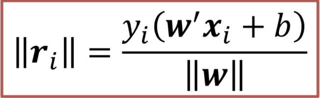
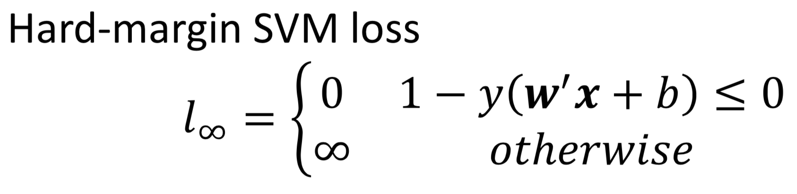
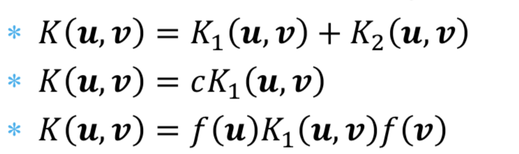
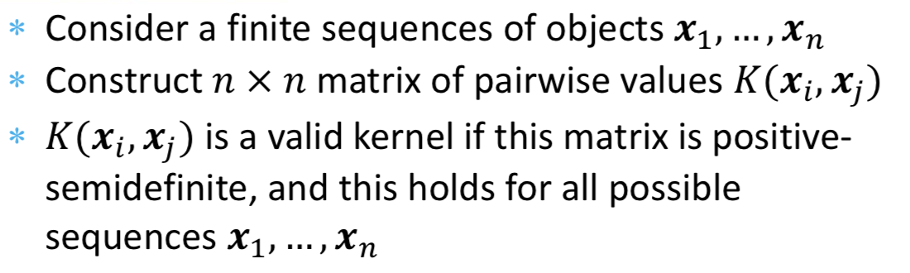
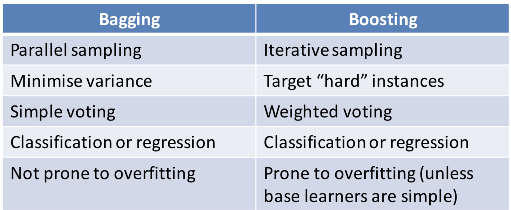
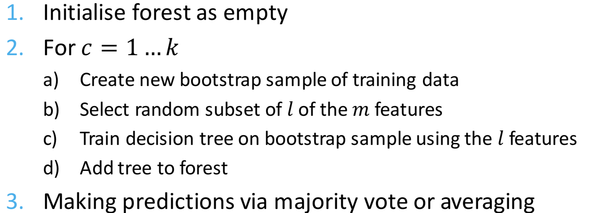
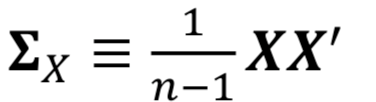
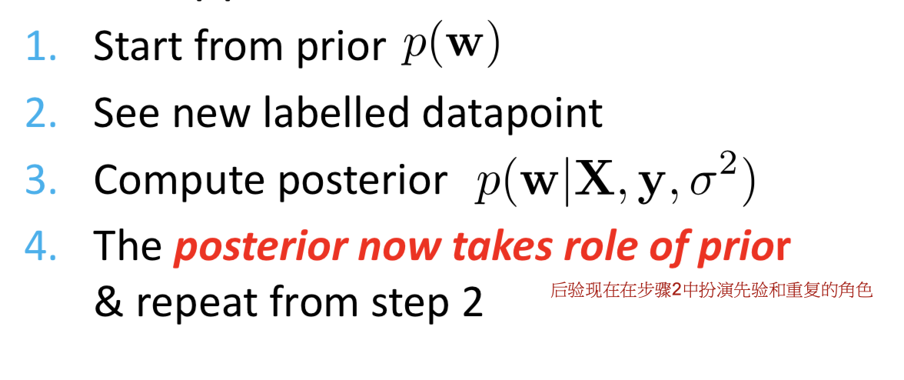

# 算法

| ML Methods                         | Concepts                                                     | Problems                                                     | Solutions                                                    |
| ---------------------------------- | ------------------------------------------------------------ | ------------------------------------------------------------ | ------------------------------------------------------------ |
| Linear Regression                  | Lost function(L1, L2)                                   | - Minimise (squared) errors - MLE                       | Analytic: Normal Equation Approxi: Gradient Descent     |
| Logical Regression                 | Logistic function Sigmoid function log trick transform data(kernel function or ANN) Polynomial regression radial basis functions (RBFs) | - MLE - Kernelise*                                      | Analytic: Normal Equation Approxi: Gradient Descent     |
| Regularisation                     | To solve:     - Irrelevant features     - ill-posed problem  Regulariser as prior Constrained modelling Bias-variance trade-off  | - Add $\lambda $ for regularisation     =>  ridge regression(L2)    => lasso regression(L1),can assign zero weight to some features, which is good if there are too many features - MAP  | Use heldout/cross validation to choose $\lambda$ (try and try...) |
| Perceptron                         | Activation function - step - sign - logical (sigmoid) - ReLU | Stochastic Gradient Descent(batch)  **Cons**: 现行不可分时无解; 总是有(无限)多个解; | 如果分类错了, 那么 $𝑤􏰆←𝑤􏰆􏰎_i􏰆􏰈  - \eta * sign(s)*x_i$   |
| Backpropagation                    | Chain Rule Generative/Discriminative Mode               | Stochastic Gradient Descent(batch size= 1) **Cons**:容易overfit;early stopping **Solutions**: regularisation |                                                              |
| Convolutional Neural Network (CNN) | Depth(hidden layers count) vs Width(nodes count) **vanishing gradient problem** sliding window Downsampling **Autoencoder**(used for setup, can **reduce dimensions** or **compress data**) | **Max pooling**(for downsamping, 选择最能表现数据的一个点留下) reuse weights in the first layer |                                                              |
| Hard-margin SVM                    | 严格按照support vectors分                                    | -  - 解的无限多种表示 - loss function=错误(包括在boundary以内)就是$\infin$, 正确就是$0$ |  |
| Soft-margin SVM                    | 相比hard-margin, 允许一些错误(包括在boundary之内这种错误)    | - relax constraints - error penalise 少一点             |  - Lagrangian Duality(拉格朗日乘子法,条件受限时的最优解问题) |
| Kernel Method                      | - Separating “learning module” from feature transformation - Constructing kernels    \|- kernel 协方差矩阵是半正定矩阵(positive semi-definite, 对称的)     \|- polynomial kernel ($K(u,v) = (u'v+c)^d$) - Representer theorem | - complex if use transform function for each instance's feature  | - use kernel function directly (with all features passed to the function) - Identifying new kernels      \|-(半正定矩阵):        \|- Mercer’s theorem  |
| Ensemble                           | - Bagging(sampling with replacement, with identical weights for all instances ) - Boosting(samping with replacement, with higher weight for error instances) | - Bagging: 可以并行(parallel) - Boosting: 只能串行(sequential); 容易overfit,所以base model只能是weak的 - stack: 使用base model的结果,训练出来一个meta model  | - Bagging: voting      \|- example: random forest: - Boosting: weighted voting |
| Bandits                            | - greedy - $\epsilon-Greedy$ - UCB                 | - $\epsilon-Greedy$在随机选取的时候,没有使用现有知识 - UCB使用公式(公式中考虑了explored arm的收益,以及unexplored arm) |                                                              |
| GMM and EM                         | - EM是解MLE的一种方法(当存在latent variable,或者解析解不好求的时候) |                                                              | - EM: 2步, Expectation and Maximisation(控制变量) - 当GMM中所有的Gaussian都有相同的$w_c$和$\delta^2$ 的时候, 就是K-means |
| PCA(principle component analysis)  | - Dimensionality reduction      \|- Visualisation      \|- Computational efficiency      \|- Data compression | - covariance matrix  - kernel PCA(transform then run PCA) | 1. Choose a direction 2. Choose the next direction 3. Repeat 2  4. Project original data on the new axes 5. For each point, keep only the first 𝑙 coordinates |
| Bayesian Regression                | - $\theta$ 的概率分布                                        | - Sequential Bayesian Updating                               |  |
| Bayesian Classificaiton            |                                                              |                                                              |                                                              |
| PGM                                |                                                              |                                                              |                                                              |

